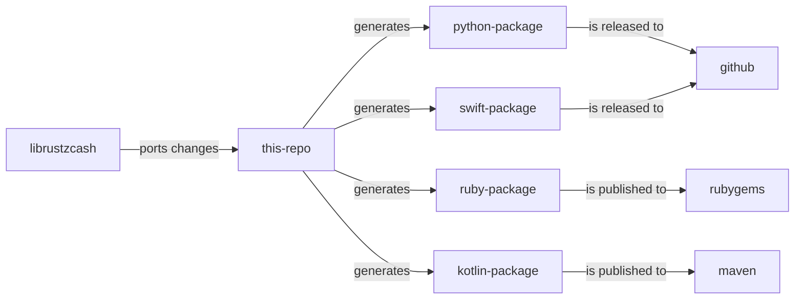

# <a href="project"></a> Zcash UniFFI project

This is a satellite 🛰️ project that aims to extend the accessibility/adoption of the Zcash core library ecosystem, aka [librustzcash](https://github.com/zcash/librustzcash) library to other language communities :handshake: 

It makes use of the mozilla [UniFFI tool](https://mozilla.github.io/uniffi-rs/) under the hood for generating an `FFI` layer for the currently targeted languages: `python`, `ruby`, `kotlin` and `swift` .

Heres is diagram that shows the mental model of the project and how the updates in the code are flowing.



All the commented steps happens in the [CI pipeline](./.github/workflows/), but developers can also execute them locally by making use of our [internal tooling](./lib/uniffi-zcash-cli/README.md).

## <a href="where-to-find-packages"></a> Where to find my language package ?

This project provides a [CI pipeline](./.github/workflows/) that automatically publish each language package:

 - Swift: Go to `File > Add Packages ...` and paste this URL into the search bar in the upper right corner of the modal: https://github.com/eigerco/uniffi-swift-pkg/
 - Ruby: published on RubyGems through Github, instructions at [this link](https://github.com/orgs/eigerco/packages/rubygems/zcash)
 - Kotlin: published on Maven through Github, instructions at [this link](https://github.com/eigerco/uniffi-kotlin-pkg/packages/1895780)
 - Python: it may be downloaded with pip as a release from our repo:
```
pip3 install git+https://github.com/eigerco/uniffi-python-pkg.git#egg=uniffi-zcash 
```

This divide is caused by the support of Github packages: while it does support RubyGems and Apache Maven registries, it isn't the same for Python and Swift, which may be instead released and downloaded directly as tarballs.

## <a href="manuals-and-docs"></a> Manuals and other docs

 [Manuals](../../wiki/Manuals) are part of our [wiki](../../wiki). We recommend to check the home page for other interesting documentation.

## <a href="building-packages-locally"></a> Building packages locally

As an alternative to the [languages package registries](#-where-to-find-packages), this repository provides a [CLI](./lib/uniffi-zcash-cli/README.md) for managing internal repo workflows. It allows developers to access all generation stages. Before continuing, the [setup of some basic software](./CONTRIBUTING.md#-local-environment-setup) is needed.

1. Clone the repo and go to the `lib` folder:
   ```bash
   $ git clone https://github.com/eigerco/uniffi-zcash-lib.git
   $ cd uniffi-zcash-lib/lib
   ```
2. Setup your environment, ⚠️ this will attempt to install [pre-requisites](./lib/uniffi-zcash-cli/src/setup.rs) in your environment:
   ```bash
   $ cargo run -p uniffi-zcash-cli setup buildenv
   ```

3. Generate the shared libraries for Linux and MacOS. This command will leave its outputs at `lib/shared_libs` 
   See the [CLI docs](./lib/uniffi-zcash-cli/README.md) for more details about pre-requisites:
   
   ```bash
   $ cargo run -p uniffi-zcash-cli sharedlibs
   ```
   
4. Generate the bindings for the desired languages, this calls the UniFFI CLI tool under the hood:
   ```bash
   $ cargo run -p uniffi-zcash-cli bindgen --languages=python,ruby,kotlin,swift
   ```
   This command will leave a folder per selected language in the `lib/bindings` directory, containing the needed files for the next command. Depending on the intention, this could be enough. But if you want the packaged, please continue to the next step.

5. Finally generate the redistributable packages for all the desired languages (python for this example).
   Please, check the CLI help and [docs](./lib/uniffi-zcash-cli/README.md) for required arguments and configuration.

   ```bash
   $ cargo run -p uniffi-zcash-cli release python -v {{semver_version}}
   ## lots of output ...
   Python test application successfully executed ✅
   ```
   The same command will work for the different languages, see the CLI `--help` . For the  `swift` case, its needed to configure a local GIT repo and pass its URL (it can be a filesystem url)  to the CLI. The CLI will clone the repo and overwrite the relevant files, preparing everything for the later publish step.
   
   We should see a "{{language}} test application successfully executed ✅" message at the end of the package build commands. That means the package has been built and imported by a temporary [test application](./lib/uniffi-zcash-cli/templates/) on the flight with success. See the internal [CLI docs](./lib/uniffi-zcash-cli/README.md) for more information. The value of the {{ semver_version }} argument is not critical if only local package testing is intended.
   
   For `python` and `ruby` , the packages are automatically installed in the user local package space. As an example, a python user could now execute Zcash code from the REPL:
   
   ```pyhton
   $ python
   >>> from zcash import *
   >>> amount = ZcashAmount(100)
   >>> amount.value()
   100
   ```

​		In the case of `kotlin` , the artifact should be present in the local maven repository, which is normally under `$HOME/.m2`. Applications can require 	then by making use of the local maven repository.

​		For `swift` check the outcome at `lib/packages/swift` , it should be a pointer to the package location. That is done because we cannot have a non submodule child repository on this project ones.

All the generated packages per each languages should be under the  `lib/packages` git ignored folder.


## <a href="generating-documentation"></a> Generating documentation

The [CLI](./lib/uniffi-zcash-cli/README.md) has documentation generation capabilities. The documentation can be generated for any target language. As an example, this command will generate the Python documentation:

```bash
$ cargo run -p uniffi-zcash-cli docgen python -v 0.0.0
```

The documentation can be found now at the `lib/docs/python` folder.

**Note**: The above command needs the packages ready in the `lib/packages` folder. See [build locally](#-building-the-packages-locally) instructions for more info.

Currently, for `kotlin` documentation, we need to setup some dependencies by:

```bash
$ cargo run -p uniffi-zcash-cli setup builddoc
```

## <a href="contributing"></a> Contributing

Visit our [CONTRIBUTING.md](./CONTRIBUTING.md) section.

## <a href="faq"></a> FAQ

* Why are all the classes and functions at the same package level ?
  * We needed to keep with a flat structure due to UniFFI [limitations](https://mozilla.github.io/uniffi-rs/udl/ext_types.html). Not all the languages support inter-crate bindings dependencies.
* Why so much insistence about including the shared library in the target packages ?
  * We wanted to favor a better user experience of the packages. Similar to what a pure language lib looks like.
* I am developing with `Xcode` or `macos` in general. Where i can find the files to include them on my project ?
  * By following the step `2` of [build locally](#-building-the-packages-locally) instructions you should get all files by free. Then there is documentation [here](https://mozilla.github.io/uniffi-rs/swift/xcode.html) and a example application [here](https://github.com/mozilla/uniffi-rs/tree/main/examples/app/ios). If you have any problems, please, open a [new issue](../../issue/new). We are happy to know about your endeavors.
