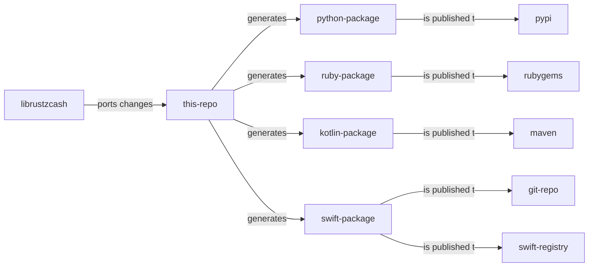

# <a href="project"></a> Zcash UniFFI project

This is a satellite 🛰️ project that aims to extend the accessibility/adoption of the Zcash core library ecosystem, aka [librustzcash](https://github.com/zcash/librustzcash) library to other language communities :handshake: 

It makes use of the mozilla [UniFFI tool](https://mozilla.github.io/uniffi-rs/) under the hood for generating an `FFI` layer for the currently targeted languages: `python`, `ruby`, `kotlin` and `swift` .

Heres is diagram that shows the mental model of the project and how the updates in the code are flowing.



All steps commented happens in the [CI pipeline](./.github/workflows/), but developers can also execute them locally by making use of our [internal tooling](./lib/uniffi-zcash-cli/README.md).

## <a href="where-to-find-packages"></a> Where to find my language package ?

This project provides a [CI pipeline](./.github/workflows/) that automatically publish each language package on the relevant registries:

* [Pypi](https://pypi.org/) TBD - link to package pypi page when first time publication.
* [Rubygems](https://guides.rubygems.org/) TBD - link to package ruby page when first time publication.
* [maven](https://search.maven.org/) TBD - link to package kotlin page when first time publication.
* [swiftpackageregistry](https://swiftpackageregistry.com/) TBD - link to package swift page when first time publication.
* [swift dependency repository]() TBD - link to package swift page when first time publication.

## <a href="manuals-and-docs"></a> Manuals and other docs

 [Manuals](../../wiki/Manuals) are part of our [wiki](../../wiki). We recommend to check the home page for other interesting documentation.

## <a href="building-packages-locally"></a> Building packages locally

As an alternative to the [languages package registries](#-where-to-find-packages), this repository provides a [CLI](./lib/uniffi-zcash-cli/README.md) for managing internal repo workflows. It allows developers to access all generation stages. The [configuration of some basic software](./CONTRIBUTING.md#-local-environment-setup) is needed.

1. Clone the repo and go to the `lib` folder:
   ```bash
   git clone https://github.com/eigerco/uniffi-zcash-lib.git
   cd uniffi-zcash-lib/lib
   ```

2. Generate the bindings plus the shared library for the desired languages, this calls the UniFFI tool under the hood:
   ```bash
   $ cargo run -p uniffi-zcash-cli bindgen --languages=python,ruby,kotlin,swift
   ```
   This command will leave a folder per language in the `lib/bindings` directory, containing the needed files for each languages for the next command. Depending on the intention, this could be enough.

3. Finally generate the redistributable packages for all the desired languages (all for this example). This step only supports linux targets currently.
   Please, check the CLI help and [docs](./lib/uniffi-zcash-cli/README.md) for required arguments and configuration.

   ```bash
   $ cargo run -p uniffi-zcash-cli release python -v {{semver_version}}
   ## lots of output ...
   Python test application successfully executed ✅
   ```
   ```bash
   $ cargo run -p uniffi-zcash-cli release ruby -v {{semver_version}}
   ## lots of output ...
   Ruby test application successfully executed ✅
   ```
   ```bash
   $ cargo run -p uniffi-zcash-cli release kotlin -v {{semver_version}}
   ## lots of output ...
   Kotlin test application successfully executed ✅
   ```
   For the following `swift` case, its needed to configure a local GIT repo and pass its URL (it can be a filesystem url)  to the CLI (see cli help). The CLI will clone the repo and overwrite the relevant files, preparing everything for the later publish step.

   ```bash
   $ cargo run -p uniffi-zcash-cli release swift -v {{semver_version}}
   ## lots of output ...
   Swift test application successfully executed ✅
   ```


We should see a "{{language}} test application successfully executed ✅" message at the end of the package build commands. That means the package has been built and imported by a temporary [test application](./lib/uniffi-zcash-cli/templates/) on the flight with success. See the internal [CLI docs](./lib/uniffi-zcash-cli/README.md) for more information. The value of the {{ semver_version }} argument is not critical if only local package testing is intended.

* For `python` and `ruby` , the packages are automatically installed in the user local package space. As an example, a python user could now execute Zcash code from the REPL:

  ```pyhton
  $ python
  >>> from zcash import *
  >>> amount = ZcashAmount(100)
  >>> amount.value()
  100
  ```

* In the case of `kotlin` , the artifact should be present in the local maven repository, which is normally under `$HOME/.m2`. Applications can require then by making use of the local maven repository.

* For `swift` check the outcome at `lib/packages/swift` , it should be a pointer to the package location.

All the generated packages per each languages should be under the  `lib/packages` git ignored folder.


## Generating documentation

At the moment the UniFFI library doesn't have the ability to add inline documentation. We are prototyping that feature [here](https://github.com/eigerco/uniffi-rs).  A prototype should be available at some point. The tools to generate documentation for each platform are:

 - Kotlin: [Dokka](https://kotlinlang.org/docs/kotlin-doc.html)
 - Python: [pydoc](https://docs.python.org/es/3/library/pydoc.html)
 - Ruby: [YARD](https://yardoc.org/)
 - Swift: [DDoc]()

which are, to our understanding, the most common tools used in each ecosystem.

## Contributing

Visit our [CONTRIBUTING.md](./CONTRIBUTING.md) section.

## FAQ

* Why are all the classes and functions at the same package level ?
  * We needed to keep with a flat structure due to UniFFI [limitations](https://mozilla.github.io/uniffi-rs/udl/ext_types.html). Not all the languages support inter-crate bindings dependencies.
* Why so much insistence about including the shared library in the target packages ?
  * We wanted to favor a better user experience of the packages. Similar to what a pure language lib looks like.
* Why the dependencies are so weighty (~50MB) ?
  * We include the `Sapling` [crypto setup](https://z.cash/technology/paramgen/) in the shared library. That way, users do not need to download them separately. This is needed for doing `Sapling` transactions.
* I am developing with `Xcode` or `macos` in general. Where i can find the files to include them on my project ?
  * By following the step `2` of [build locally](#-building-the-packages-locally) instructions you should get all files by free. Then there is documentation [here](https://mozilla.github.io/uniffi-rs/swift/xcode.html) and a example application [here](https://github.com/mozilla/uniffi-rs/tree/main/examples/app/ios). If you have any problems, please, open a [new issue](../../issue/new). We are happy to know about your endeavors.
