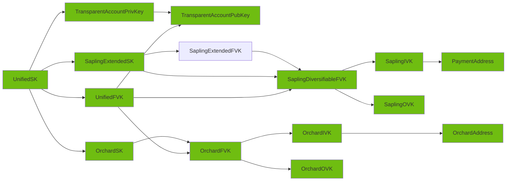

# Completion map

We currently have implemented and tested the following object graph:

* See API surface section below to see the API detailed status.

# FFI API features matrix

This is a feature matrix which keeps track of the current state of implementation for the FFI API surface. Here are the descriptions of each column:

* `Object/Method name`: The listing of all the `pub` methods that could be implemented for FFI .
* `Score`: How important is nowadays this. Being.
  * :red_circle: Essential.
  * :large_blue_circle: Nice to have.
  * :white_circle: Not interesting.
  *  If they do not have colour, evaluation is still needed.
* `UDL`:  The code is present in the Mozilla `UDL` file.
* `Code`: If theres an existing implementation in the Rust wrapper code.
* `Test`: Theres test coverage for this element. Directly or indirectly.
* `Docs`: If there is function level documentation in the `FFI` code, which later will be automatically generated bindings for all languages ([we are working on it](https://github.com/eigerco/uniffi-rs/issues)). See format to be followed [here](https://github.com/eigerco/uniffi-rs/issues/5#issuecomment-1436618667).

**Notes** :

* This should be kept up to date with new developments/findings.
* Its still in progress the creation of new types for `Orchard` below in this index.

## Table of contents

* [Errors](#errors)
* [Objects](#objects)
* [Enums](#enums)
* [Records](#records)
* [Functions](#functions)

## Errors

We use a single `ZcashError` encompassing following errors:

* `HDWalletError` - original type: [hdwallet::error::Error](https://docs.rs/hdwallet/latest/hdwallet/error/enum.Error.html)
* `DerivationError` - original type: [zcash_client_backend::keys::DerivationError]()
* `DecodingError` - original type: [zcash_client_backend::keys::DecodingError]()
* `InvalidAsk` - original type: [zcash_primitives::sapling::keys::DecodingError::InvalidAsk](https://docs.rs/zcash_primitives/latest/zcash_primitives/sapling/keys/enum.DecodingError.html#variant.InvalidAsk)
* `InvalidNsk`- original type: [zcash_primitives::sapling::keys::DecodingError::InvalidNsk](https://docs.rs/zcash_primitives/latest/zcash_primitives/sapling/keys/enum.DecodingError.html#variant.InvalidNsk)
* `Message` - generic `String` message error
* `ArrayLengthMismatch` - used when `sequence<u8>` length doesn't match expected array length
* `ValueOutOfRange` - used when value is outside of expected range
* `Secp256k1Error` - original type: [secp256k1::Error](https://docs.rs/secp256k1/latest/secp256k1/enum.Error.html)
* `Bech32DecodeError` - original type: [zcash_client_backend::encoding::Bech32DecodeError](https://docs.rs/zcash_client_backend/latest/zcash_client_backend/encoding/enum.Bech32DecodeError.html),
* `Bs58Error` - original type: [bs58::decode::Error](https://docs.rs/bs58/latest/bs58/decode/enum.Error.html),
* `BuilderError` - original type: [zcash_primitives::transaction::builder::Error](https://docs.rs/zcash_primitives/0.10.2/zcash_primitives/transaction/builder/enum.Error.html), with fee errors from [zcash_primitives::transaction::fees::zip317::FeeError](https://docs.rs/zcash_primitives/0.10.2/zcash_primitives/transaction/fees/zip317/enum.FeeError.html). Serves as a catch all error for all the errors we are not handling specifically. This is for the general transaction builder.
* `TransparentBuilderError` - original type: [transaction::components::transparent::builder::Error](https://docs.rs/zcash_primitives/0.10.2/zcash_primitives/transaction/components/transparent/builder/enum.Error.html). Serves as a catch all error for all the errors we are not specifically handling from the `Transparent` transaction builder.
* `SaplingBuilderError`- original type: [transaction::components::sapling::builder::Error](https://docs.rs/zcash_primitives/0.10.2/zcash_primitives/transaction/components/sapling/builder/enum.Error.html). Serves as a catch all error for all the errors we are not specifically handling from the `Sapling` transaction builder.
* `OrchardBuilderError`- original type: [orchard::builder::Error](https://docs.rs/orchard/0.3.0/orchard/builder/enum.Error.html). Serves as a catch all error for all the errors we are not specifically handling from the `Orchard` transaction builder.
* `InsufficientFundsError` - original type: [zcash_primitives::transaction::builder::Error](https://docs.rs/zcash_primitives/0.10.2/zcash_primitives/transaction/builder/enum.Error.html#variant.InsufficientFunds) . This error comes from the general transaction builder. We expose it explicitly to the user.
* `ChangeRequiredError` - original type: [zcash_primitives::transaction::builder::Error](https://docs.rs/zcash_primitives/0.10.2/zcash_primitives/transaction/builder/enum.Error.html#variant.ChangeRequired) . This error comes from the general transaction builder. We expose it explicitly to the user.
* `Unknown` - unknown error, usually used for constructors that return `Option`.

## Objects

### ZcashAccountPrivKey

* Original type: [zcash_primitives::legacy::keys::AccountPrivKey](https://docs.rs/zcash_primitives/0.10.0/zcash_primitives/legacy/keys/struct.AccountPrivKey.html)

| Object/Method name                                                                        |    Score     |        UDL         |        Code        |       Tests        |        Docs        |
| ----------------------------------------------------------------------------------------- | :----------: | :----------------: | :----------------: | :----------------: | :----------------: |
| ZcashAccountPrivKey::from_seed()                                                          | :red_circle: | :white_check_mark: | :white_check_mark: | :white_check_mark: | :white_check_mark: |
| ZcashAccountPrivKey::from_extended_privkey([ZcashExtendedPrivKey](#zcashextendedprivkey)) | :red_circle: | :white_check_mark: | :white_check_mark: | :white_check_mark: | :white_check_mark: |
| ZcashAccountPrivKey::to_account_pubkey()                                                  | :red_circle: | :white_check_mark: | :white_check_mark: | :white_check_mark: | :white_check_mark: |
| ZcashAccountPrivKey::derive_external_secret_key() -> [SecpSecretKey](#secpsecretkey)      | :red_circle: | :white_check_mark: | :white_check_mark: | :white_check_mark: | :white_check_mark: |
| ZcashAccountPrivKey::derive_internal_secret_key() -> [SecpSecretKey](#secpsecretkey)      | :red_circle: | :white_check_mark: | :white_check_mark: | :white_check_mark: | :white_check_mark: |
| ZcashAccountPrivKey::to_bytes()                                                           | :red_circle: | :white_check_mark: | :white_check_mark: | :white_check_mark: | :white_check_mark: |
| ZcashAccountPrivKey::from_bytes()                                                         | :red_circle: | :white_check_mark: | :white_check_mark: | :white_check_mark: | :white_check_mark: |

### SecpSecretKey

* Original type: [secp256k1::SecretKey](https://docs.rs/secp256k1/0.27.0/secp256k1/struct.SecretKey.html)

:warning: This type does not belong to the zcash API, but its returned from some methods. We are just providing support for serialization, so the user can deserialize the secret by making use of another `secp256k1` library in their specific language.

| Object/Method name                 |     Score      |        UDL         |        Code        |       Tests        |        Docs        |
| ---------------------------------- | :------------: | :----------------: | :----------------: | :----------------: | :----------------: |
| SecpSecretKey::display_secret()    | :white_circle: |                    |                    |                    |                    |
| SecpSecretKey::non_secure_erase()  | :white_circle: |                    |                    |                    |                    |
| SecpSecretKey::from_slice()        |  :red_circle:  | :white_check_mark: | :white_check_mark: | :white_check_mark: | :white_check_mark: |
| SecpSecretKey::serialize_secret()  |  :red_circle:  | :white_check_mark: | :white_check_mark: | :white_check_mark: | :white_check_mark: |
| SecpSecretKey::from_keypair()      | :white_circle: |                    |                    |                    |                    |
| SecpSecretKey::from_hashed_data()  | :white_circle: |                    |                    |                    |                    |
| SecpSecretKey::secret_bytes()      | :white_circle: |                    |                    |                    |                    |
| SecpSecretKey::negate()            | :white_circle: |                    |                    |                    |                    |
| SecpSecretKey::add_tweak()         | :white_circle: |                    |                    |                    |                    |
| SecpSecretKey::mul_tweak()         | :white_circle: |                    |                    |                    |                    |
| SecpSecretKey::negate_assign()     | :white_circle: |                    |                    |                    |                    |
| SecpSecretKey::add_assign()        | :white_circle: |                    |                    |                    |                    |
| SecpSecretKey::mul_assign()        | :white_circle: |                    |                    |                    |                    |
| SecpSecretKey::sign_ecdsa()        | :white_circle: |                    |                    |                    |                    |
| SecpSecretKey::keypair()           | :white_circle: |                    |                    |                    |                    |
| SecpSecretKey::public_key()        | :white_circle: |                    |                    |                    |                    |
| SecpSecretKey::x_only_public_key() | :white_circle: |                    |                    |                    |                    |

### ZcashExtendedPrivKey

* Original type: [hdwallet::extended_key::ExtendedPrivKey](https://docs.rs/hdwallet/latest/hdwallet/extended_key/struct.ExtendedPrivKey.html)

| Object/Method name                            |    Score     |        UDL         |        Code        |       Tests        |        Docs        |
| --------------------------------------------- | :----------: | :----------------: | :----------------: | :----------------: | :----------------: |
| ZcashExtendedPrivKey::from_bytes()            |              | :white_check_mark: | :white_check_mark: | :white_check_mark: | :white_check_mark: |
| ZcashExtendedPrivKey::to_bytes()              |              | :white_check_mark: | :white_check_mark: | :white_check_mark: | :white_check_mark: |
| ZcashExtendedPrivKey::random()                |              | :white_check_mark: | :white_check_mark: | :white_check_mark: | :white_check_mark: |
| ZcashExtendedPrivKey::random_with_seed_size() |              | :white_check_mark: | :white_check_mark: | :white_check_mark: | :white_check_mark: |
| ZcashExtendedPrivKey::with_seed()             | :red_circle: | :white_check_mark: | :white_check_mark: | :white_check_mark: | :white_check_mark: |
| ZcashExtendedPrivKey::derive_private_key()    |              | :white_check_mark: | :white_check_mark: | :white_check_mark: | :white_check_mark: |

### ZcashAccountPubKey

* Original type: [zcash_primitives::legacy::keys::AccountPubKey](https://docs.rs/zcash_primitives/0.10.0/zcash_primitives/legacy/keys/struct.AccountPubKey.html)

| Object/Method name                                                  |    Score     |        UDL         |        Code        |       Tests        |        Docs        |
| ------------------------------------------------------------------- | :----------: | :----------------: | :----------------: | :----------------: | :----------------: |
| ZcashAccountPubKey::derive_external_ivk()                           | :red_circle: | :white_check_mark: | :white_check_mark: | :white_check_mark: | :white_check_mark: |
| ZcashAccountPubKey::derive_internal_ivk()                           | :red_circle: | :white_check_mark: | :white_check_mark: | :white_check_mark: | :white_check_mark: |
| ZcashAccountPubKey::ovks_for_shielding()                            | :red_circle: | :white_check_mark: | :white_check_mark: | :white_check_mark: | :white_check_mark: |
| ZcashAccountPubKey::internal_ovk()                                  | :red_circle: | :white_check_mark: | :white_check_mark: | :white_check_mark: | :white_check_mark: |
| ZcashAccountPubKey::external_ovk()                                  | :red_circle: | :white_check_mark: | :white_check_mark: | :white_check_mark: | :white_check_mark: |
| ZcashAccountPubKey::serialize()                                     | :red_circle: | :white_check_mark: | :white_check_mark: | :white_check_mark: | :white_check_mark: |
| ZcashAccountPubKey::deserialize() (renamed to new() as constructor) | :red_circle: | :white_check_mark: | :white_check_mark: | :white_check_mark: | :white_check_mark: |

### ZcashUnifiedSpendingKey

* Original type: [zcash_client_backend::keys::UnifiedSpendingKey]()

| Object/Method name                                                                                                  |    Score     |        UDL         |        Code        |       Tests        |        Docs        |
| ------------------------------------------------------------------------------------------------------------------- | :----------: | :----------------: | :----------------: | :----------------: | :----------------: |
| ZcashUnifiedSpendingKey::from_seed()                                                                                | :red_circle: | :white_check_mark: | :white_check_mark: | :white_check_mark: | :white_check_mark: |
| ZcashUnifiedSpendingKey::to_unified_full_viewing_key() -> [ZcashUnifiedFullViewingKey](#zcashunifiedfullviewingkey) | :red_circle: | :white_check_mark: | :white_check_mark: | :white_check_mark: | :white_check_mark: |
| ZcashUnifiedSpendingKey::transparent() -> [ZcashAccountPrivKey](#zcashaccountprivkey)                               | :red_circle: | :white_check_mark: | :white_check_mark: |                    | :white_check_mark: |
| ZcashUnifiedSpendingKey::sapling() -> [ZcashExtendedSpendingKey](#zcashextendedspendingkey-sapling)                 | :red_circle: | :white_check_mark: | :white_check_mark: |                    | :white_check_mark: |
| ZcashUnifiedSpendingKey::orchard() -> [ZcashOrchardSpendingKey](#zcashorchardspendingkey)                           | :red_circle: | :white_check_mark: | :white_check_mark: |                    | :white_check_mark: |
| ZcashUnifiedSpendingKey::to_bytes()                                                                                 | :red_circle: | :white_check_mark: | :white_check_mark: | :white_check_mark: | :white_check_mark: |
| ZcashUnifiedSpendingKey::from_bytes()                                                                               |              | :white_check_mark: | :white_check_mark: | :white_check_mark: | :white_check_mark: |

### ZcashUnifiedFullViewingKey

* Original type: [zcash_client_backend::keys::UnifiedFullViewingKey]()

| Object/Method name                                                                                                                 |    Score     |        UDL         |        Code        |       Tests        |        Docs        |
| ---------------------------------------------------------------------------------------------------------------------------------- | :----------: | :----------------: | :----------------: | :----------------: | :----------------: |
| ZcashUnifiedFullViewingKey::new()                                                                                                  |              | :white_check_mark: | :white_check_mark: | :white_check_mark: | :white_check_mark: |
| ZcashUnifiedFullViewingKey::decode()                                                                                               | :red_circle: | :white_check_mark: | :white_check_mark: | :white_check_mark: | :white_check_mark: |
| ZcashUnifiedFullViewingKey::encode()                                                                                               | :red_circle: | :white_check_mark: | :white_check_mark: | :white_check_mark: | :white_check_mark: |
| ZcashUnifiedFullViewingKey::transparent() -> [ZcashAccountPubKey](#zcashaccountpubkey)                                             | :red_circle: | :white_check_mark: | :white_check_mark: | :white_check_mark: | :white_check_mark: |
| ZcashUnifiedFullViewingKey::sapling() -> [ZcashDiversifiableFullViewingKey](#zcashdiversifiablefullviewingkey-sapling)             | :red_circle: | :white_check_mark: | :white_check_mark: | :white_check_mark: | :white_check_mark: |
| ZcashUnifiedFullViewingKey::orchard() -> [ZcashOrchardFullViewingKey](#zcashorchardfullviewingkey)                                 | :red_circle: | :white_check_mark: | :white_check_mark: | :white_check_mark: | :white_check_mark: |
| ZcashUnifiedFullViewingKey::address() -> [ZcashUnifiedAddress](#zcashunifiedaddress)                                               |              | :white_check_mark: | :white_check_mark: | :white_check_mark: | :white_check_mark: |
| ZcashUnifiedFullViewingKey::find_address() -> [ZcashUnifiedAddressAndDiversifierIndex](#zcashunifiedaddressanddiversifierindex)    |              | :white_check_mark: | :white_check_mark: | :white_check_mark: | :white_check_mark: |
| ZcashUnifiedFullViewingKey::default_address() -> [ZcashUnifiedAddressAndDiversifierIndex](#zcashunifiedaddressanddiversifierindex) |              | :white_check_mark: | :white_check_mark: | :white_check_mark: | :white_check_mark: |

### ZcashUnifiedAddress

* Original type: [zcash_client_backend::address::UnifiedAddress](https://docs.rs/zcash_client_backend/latest/zcash_client_backend/address/struct.UnifiedAddress.html)

| Object/Method name                                                                        |    Score     |        UDL         |        Code        |       Tests        |        Docs        |
| ----------------------------------------------------------------------------------------- | :----------: | :----------------: | :----------------: | :----------------: | :----------------: |
| ZcashUnifiedAddress::new()                                                                | :red_circle: | :white_check_mark: | :white_check_mark: | :white_check_mark: | :white_check_mark: |
| ZcashUnifiedAddress::orchard() -> [ZcashOrchardAddress](#zcashorchardaddress)             | :red_circle: | :white_check_mark: | :white_check_mark: | :white_check_mark: | :white_check_mark: |
| ZcashUnifiedAddress::sapling()-> [ZcashPaymentAddress](#zcashpaymentaddress-sapling)      | :red_circle: | :white_check_mark: | :white_check_mark: | :white_check_mark: | :white_check_mark: |
| ZcashUnifiedAddress::transparent() -> [ZcashTransparentAddress](#zcashtransparentaddress) | :red_circle: | :white_check_mark: | :white_check_mark: | :white_check_mark: | :white_check_mark: |
| ZcashUnifiedAddress::decode()                                                             | :red_circle: | :white_check_mark: | :white_check_mark: | :white_check_mark: | :white_check_mark: |
| ZcashUnifiedAddress::encode()                                                             | :red_circle: | :white_check_mark: | :white_check_mark: | :white_check_mark: | :white_check_mark: |

### ZcashRecipientAddress

* Original type: [zcash_client_backend::address::RecipientAddress](https://docs.rs/zcash_client_backend/latest/zcash_client_backend/address/enum.RecipientAddress.html)

| Object/Method name                   |    Score     |        UDL         |        Code        |       Tests        |        Docs        |
| ------------------------------------ | :----------: | :----------------: | :----------------: | :----------------: | :----------------: |
| ZcashRecipientAddress::shielded()    | :red_circle: | :white_check_mark: | :white_check_mark: | :white_check_mark: | :white_check_mark: |
| ZcashRecipientAddress::transparent() | :red_circle: | :white_check_mark: | :white_check_mark: | :white_check_mark: | :white_check_mark: |
| ZcashRecipientAddress::unified()     | :red_circle: | :white_check_mark: | :white_check_mark: | :white_check_mark: | :white_check_mark: |
| ZcashRecipientAddress::decode()      | :red_circle: | :white_check_mark: | :white_check_mark: | :white_check_mark: | :white_check_mark: |
| ZcashRecipientAddress::encode()      | :red_circle: | :white_check_mark: | :white_check_mark: | :white_check_mark: | :white_check_mark: |

### ZcashTransparentAddress

* Original type: [zcash_primitives::legacy::TransparentAddress](https://docs.rs/zcash_primitives/latest/zcash_primitives/legacy/enum.TransparentAddress.html)

| Object/Method name                       |    Score     |        UDL         |        Code        |       Tests        |        Docs        |
| ---------------------------------------- | :----------: | :----------------: | :----------------: | :----------------: | :----------------: |
| ZcashTransparentAddress::PublicKey()     | :red_circle: | :white_check_mark: | :white_check_mark: | :white_check_mark: | :white_check_mark: |
| ZcashTransparentAddress::Script()        | :red_circle: | :white_check_mark: | :white_check_mark: | :white_check_mark: | :white_check_mark: |
| ZcashTransparentAddress::script()        | :red_circle: | :white_check_mark: | :white_check_mark: | :white_check_mark: | :white_check_mark: |
| ZcashTransparentAddress::decode()        | :red_circle: | :white_check_mark: | :white_check_mark: | :white_check_mark: | :white_check_mark: |
| ZcashTransparentAddress::encode()        | :red_circle: | :white_check_mark: | :white_check_mark: | :white_check_mark: | :white_check_mark: |
| ZcashTransparentAddress::is_public_key() | :red_circle: | :white_check_mark: | :white_check_mark: | :white_check_mark: | :white_check_mark: |
| ZcashTransparentAddress::is_secret()     | :red_circle: | :white_check_mark: | :white_check_mark: | :white_check_mark: | :white_check_mark: |
| ZcashTransparentAddress::to_bytes()      | :red_circle: | :white_check_mark: | :white_check_mark: | :white_check_mark: | :white_check_mark: |

### ZcashDiversifiableFullViewingKey (Sapling)

* Original type: [zcash_client_backend::keys::sapling::DiversifiableFullViewingKey](https://docs.rs/zcash_client_backend/latest/zcash_client_backend/keys/sapling/struct.DiversifiableFullViewingKey.html)

| Object/Method name                                                                                                                       |    Score     |        UDL         |        Code        |       Tests        |        Docs        |
| ---------------------------------------------------------------------------------------------------------------------------------------- | :----------: | :----------------: | :----------------: | :----------------: | :----------------: |
| ZcashDiversifiableFullViewingKey::from_bytes()                                                                                           | :red_circle: | :white_check_mark: | :white_check_mark: | :white_check_mark: | :white_check_mark: |
| ZcashDiversifiableFullViewingKey::to_bytes()                                                                                             | :red_circle: | :white_check_mark: | :white_check_mark: | :white_check_mark: | :white_check_mark: |
| ZcashDiversifiableFullViewingKey::fvk() -> [ZcashFullViewingKey](#zcashfullviewingkey-sapling)                                           | :red_circle: | :white_check_mark: | :white_check_mark: | :white_check_mark: | :white_check_mark: |
| ZcashDiversifiableFullViewingKey::to_nk() -> [ZcashNullifierDerivingKey](#zcashnullifierderivingkey-sapling)                             | :red_circle: | :white_check_mark: | :white_check_mark: | :white_check_mark: | :white_check_mark: |
| ZcashDiversifiableFullViewingKey::to_ivk() -> [ZcashSaplingIvk](#zcashsaplingivk-sapling)                                                | :red_circle: | :white_check_mark: | :white_check_mark: | :white_check_mark: | :white_check_mark: |
| ZcashDiversifiableFullViewingKey::to_ovk() -> [ZcashOutgoingViewingKey](#zcashoutgoingviewingkey-sapling)                                | :red_circle: | :white_check_mark: | :white_check_mark: | :white_check_mark: | :white_check_mark: |
| ZcashDiversifiableFullViewingKey::address() -> [ZcashPaymentAddress](#zcashpaymentaddress-sapling)                                       | :red_circle: | :white_check_mark: | :white_check_mark: | :white_check_mark: | :white_check_mark: |
| ZcashDiversifiableFullViewingKey::find_address() -> [ZcashDiversifierIndexAndPaymentAddress](#zcashdiversifierindexandpaymentaddress)    | :red_circle: | :white_check_mark: | :white_check_mark: | :white_check_mark: | :white_check_mark: |
| ZcashDiversifiableFullViewingKey::default_address() -> [ZcashDiversifierIndexAndPaymentAddress](#zcashdiversifierindexandpaymentaddress) | :red_circle: | :white_check_mark: | :white_check_mark: | :white_check_mark: | :white_check_mark: |
| ZcashDiversifiableFullViewingKey::diversified_address() -> [ZcashPaymentAddress](#zcashpaymentaddress-sapling)                           | :red_circle: | :white_check_mark: | :white_check_mark: | :white_check_mark: | :white_check_mark: |
| ZcashDiversifiableFullViewingKey::change_address() -> [ZcashDiversifierIndexAndPaymentAddress](#zcashdiversifierindexandpaymentaddress)  | :red_circle: | :white_check_mark: | :white_check_mark: | :white_check_mark: | :white_check_mark: |
| ZcashDiversifiableFullViewingKey::diversified_change_address() -> [ZcashPaymentAddress](#zcashpaymentaddress-sapling)                    | :red_circle: | :white_check_mark: | :white_check_mark: | :white_check_mark: | :white_check_mark: |
| ZcashDiversifiableFullViewingKey::decrypt_diversifier() -> [ZcashDiversifierIndexAndScope](#zcashdiversifierindexandscope)               | :red_circle: | :white_check_mark: | :white_check_mark: | :white_check_mark: | :white_check_mark: |

### ZcashExtendedSpendingKey (Sapling)

* Original type: [zcash_primitives::zip32::sapling::ExtendedSpendingKey](https://docs.rs/zcash_primitives/0.10.0/zcash_primitives/zip32/sapling/struct.ExtendedSpendingKey.html)

| Object/Method name                                                                                                                             |    Score     |        UDL         |        Code        |       Tests        |        Docs        |
| ---------------------------------------------------------------------------------------------------------------------------------------------- | :----------: | :----------------: | :----------------: | :----------------: | :----------------: |
| ZcashExtendedSpendingKey::encode()                                                                                                             | :red_circle: | :white_check_mark: | :white_check_mark: | :white_check_mark: | :white_check_mark: |
| ZcashExtendedSpendingKey::decode()                                                                                                             | :red_circle: | :white_check_mark: | :white_check_mark: | :white_check_mark: | :white_check_mark: |
| ZcashExtendedSpendingKey::master()                                                                                                             | :red_circle: | :white_check_mark: | :white_check_mark: | :white_check_mark: | :white_check_mark: |
| ZcashExtendedSpendingKey::from_bytes()                                                                                                         | :red_circle: | :white_check_mark: | :white_check_mark: | :white_check_mark: | :white_check_mark: |
| ZcashExtendedSpendingKey::to_bytes()                                                                                                           | :red_circle: | :white_check_mark: | :white_check_mark: | :white_check_mark: | :white_check_mark: |
| ZcashExtendedSpendingKey::from_path()                                                                                                          | :red_circle: | :white_check_mark: | :white_check_mark: | :white_check_mark: | :white_check_mark: |
| ZcashExtendedSpendingKey::derive_child() -> [ZcashExtendedSpendingKey](#zcashextendedspendingkey-sapling)                                      | :red_circle: | :white_check_mark: | :white_check_mark: | :white_check_mark: | :white_check_mark: |
| ZcashExtendedSpendingKey::default_address() -> [ZcashDiversifierIndexAndPaymentAddress](#zcashdiversifierindexandpaymentaddress)               | :red_circle: | :white_check_mark: | :white_check_mark: | :white_check_mark: | :white_check_mark: |
| ZcashExtendedSpendingKey::derive_internal() -> [ZcashExtendedSpendingKey](#zcashextendedspendingkey-sapling)                                   | :red_circle: | :white_check_mark: | :white_check_mark: | :white_check_mark: | :white_check_mark: |
| ZcashExtendedSpendingKey::to_extended_full_viewing_key() - *deprecated*                                                                        |              |                    |                    |                    |                    |
| ZcashExtendedSpendingKey::to_diversifiable_full_viewing_key() -> [ZcashDiversifiableFullViewingKey](#zcashdiversifiablefullviewingkey-sapling) | :red_circle: | :white_check_mark: | :white_check_mark: | :white_check_mark: | :white_check_mark: |

### ZcashExtendedFullViewingKey (Sapling)

* Original type: [zcash_primitives::zip32::sapling::ExtendedFullViewingKey](https://docs.rs/zcash_primitives/0.10.0/zcash_primitives/zip32/sapling/struct.ExtendedFullViewingKey.html)

| Object/Method name                                                                                                                                |    Score     |        UDL         |        Code        |       Tests        |        Docs        |
| ------------------------------------------------------------------------------------------------------------------------------------------------- | :----------: | :----------------: | :----------------: | :----------------: | :----------------: |
| ZcashExtendedFullViewingKey::encode()                                                                                                             | :red_circle: | :white_check_mark: | :white_check_mark: | :white_check_mark: | :white_check_mark: |
| ZcashExtendedFullViewingKey::decode()                                                                                                             | :red_circle: | :white_check_mark: | :white_check_mark: | :white_check_mark: | :white_check_mark: |
| ZcashExtendedFullViewingKey::from_bytes()                                                                                                         | :red_circle: | :white_check_mark: | :white_check_mark: | :white_check_mark: | :white_check_mark: |
| ZcashExtendedFullViewingKey::to_bytes()                                                                                                           | :red_circle: | :white_check_mark: | :white_check_mark: | :white_check_mark: | :white_check_mark: |
| ZcashExtendedFullViewingKey::derive_child() -> [ZcashExtendedFullViewingKey](#zcashextendedfullviewingkey-sapling)                                | :red_circle: | :white_check_mark: | :white_check_mark: | :white_check_mark: | :white_check_mark: |
| ZcashExtendedFullViewingKey::find_address() -> [ZcashDiversifierIndexAndPaymentAddress](#zcashdiversifierindexandpaymentaddress)                  | :red_circle: | :white_check_mark: | :white_check_mark: | :white_check_mark: | :white_check_mark: |
| ZcashExtendedFullViewingKey::default_address() -> [ZcashDiversifierIndexAndPaymentAddress](#zcashdiversifierindexandpaymentaddress)               | :red_circle: | :white_check_mark: | :white_check_mark: | :white_check_mark: | :white_check_mark: |
| ZcashExtendedFullViewingKey::derive_internal() -> [ZcashExtendedFullViewingKey](#zcashextendedfullviewingkey-sapling)                             | :red_circle: | :white_check_mark: | :white_check_mark: | :white_check_mark: | :white_check_mark: |
| ZcashExtendedFullViewingKey::to_diversifiable_full_viewing_key() -> [ZcashDiversifiableFullViewingKey](#zcashdiversifiablefullviewingkey-sapling) | :red_circle: | :white_check_mark: | :white_check_mark: | :white_check_mark: | :white_check_mark: |

### ZcashSaplingIvk (Sapling)

* Original type: [zcash_primitives::sapling::SaplingIvk](https://docs.rs/zcash_primitives/0.10.0/zcash_primitives/sapling/index.html#reexport.SaplingIvk)

| Object/Method name                                                                                                                  |    Score     |        UDL         |        Code        |       Tests        |        Docs        |
| ----------------------------------------------------------------------------------------------------------------------------------- | :----------: | :----------------: | :----------------: | :----------------: | :----------------: |
| ZcashSaplingIvk::to_payment_address([ZcashDiversifier](###ZcashDiversifier)) -> [ZcashPaymentAddress](#zcashpaymentaddress-sapling) | :red_circle: | :white_check_mark: | :white_check_mark: | :white_check_mark: | :white_check_mark: |
| ZcashSaplingIvk::to_repr()                                                                                                          |              | :white_check_mark: | :white_check_mark: | :white_check_mark: | :white_check_mark: |

### ZcashDiversifier (Sapling)

* Original type: [zcash_primitives::sapling::Diversifier](https://docs.rs/zcash_primitives/latest/zcash_primitives/sapling/keys/struct.Diversifier.html)

| Object/Method name          |    Score     |        UDL         |        Code        |       Tests        |        Docs        |
| --------------------------- | :----------: | :----------------: | :----------------: | :----------------: | :----------------: |
| ZcashDiversifier::new()     | :red_circle: | :white_check_mark: | :white_check_mark: | :white_check_mark: | :white_check_mark: |
| ZcashDiversifier::toBytes() | :red_circle: | :white_check_mark: | :white_check_mark: | :white_check_mark: | :white_check_mark: |
| ZcashDiversifier::g_d()     |              |                    |                    |                    |                    |

### ZcashExpandedSpendingKey (Sapling)

* Original type: [zcash_primitives::sapling::keys::ExpandedSpendingKey](https://docs.rs/zcash_primitives/latest/zcash_primitives/sapling/keys/struct.ExpandedSpendingKey.html)

| Object/Method name                                                                                              |    Score     |        UDL         |        Code        |       Tests        |        Docs        |
| --------------------------------------------------------------------------------------------------------------- | :----------: | :----------------: | :----------------: | :----------------: | :----------------: |
| ZcashExpandedSpendingKey::from_spending_key()                                                                   | :red_circle: | :white_check_mark: | :white_check_mark: | :white_check_mark: | :white_check_mark: |
| ZcashExpandedSpendingKey::from_bytes()                                                                          | :red_circle: | :white_check_mark: | :white_check_mark: | :white_check_mark: | :white_check_mark: |
| ZcashExpandedSpendingKey::proof_generation_key() -> [ZcashProofGenerationKey](#zcashproofgenerationkey-sapling) | :red_circle: | :white_check_mark: | :white_check_mark: |                    | :white_check_mark: |
| ZcashExpandedSpendingKey::to_bytes()                                                                            | :red_circle: | :white_check_mark: | :white_check_mark: | :white_check_mark: | :white_check_mark: |

### ZcashFullViewingKey (Sapling)

* Original type: [zcash_primitives::sapling::keys::FullViewingKey](https://docs.rs/zcash_primitives/latest/zcash_primitives/sapling/keys/struct.FullViewingKey.html)

| Object/Method name                                                                        |    Score     |        UDL         |        Code        |       Tests        |        Docs        |
| ----------------------------------------------------------------------------------------- | :----------: | :----------------: | :----------------: | :----------------: | :----------------: |
| ZcashFullViewingKey::from_bytes()                                                         | :red_circle: | :white_check_mark: | :white_check_mark: | :white_check_mark: | :white_check_mark: |
| ZcashFullViewingKey::from_expanded_spending_key()                                         | :red_circle: | :white_check_mark: | :white_check_mark: | :white_check_mark: | :white_check_mark: |
| ZcashFullViewingKey::to_bytes()                                                           | :red_circle: | :white_check_mark: | :white_check_mark: | :white_check_mark: | :white_check_mark: |
| ZcashFullViewingKey::vk() -> [ZcashViewingKey](#zcashviewingkey-sapling)                  | :red_circle: | :white_check_mark: | :white_check_mark: |                    | :white_check_mark: |
| ZcashFullViewingKey::ovk() -> [ZcashOutgoingViewingKey](#zcashoutgoingviewingkey-sapling) | :red_circle: | :white_check_mark: | :white_check_mark: | :white_check_mark: | :white_check_mark: |

### ZcashNullifierDerivingKey (Sapling)

* Original type: [zcash_primitives::sapling::keys::NullifierDerivingKey](https://docs.rs/zcash_primitives/latest/zcash_primitives/sapling/keys/struct.NullifierDerivingKey.html)

`NullifierDerivingKey` is a wrapper around [jubjub](https://docs.rs/jubjub/latest/jubjub/)'s `SubgroupPoint` -
exposing `jubjub` types is beyond the scope of this project.

### ZcashProofGenerationKey (Sapling)

* Original type: [zcash_primitives::sapling::keys::ProofGenerationKey](https://docs.rs/zcash_primitives/latest/zcash_primitives/sapling/keys/struct.ProofGenerationKey.html)

| Object/Method name                                                                       |    Score     |        UDL         |        Code        | Tests |        Docs        |
| ---------------------------------------------------------------------------------------- | :----------: | :----------------: | :----------------: | :---: | :----------------: |
| ZcashProofGenerationKey::to_viewing_key() -> [ZcashViewingKey](#zcashviewingkey-sapling) | :red_circle: | :white_check_mark: | :white_check_mark: |       | :white_check_mark: |

### ZcashViewingKey (Sapling)

* Original type: [zcash_primitives::sapling::keys::ViewingKey](https://docs.rs/zcash_primitives/latest/zcash_primitives/sapling/keys/struct.ViewingKey.html)

| Object/Method name                                                                           |    Score     |        UDL         |        Code        |       Tests        |        Docs        |
| -------------------------------------------------------------------------------------------- | :----------: | :----------------: | :----------------: | :----------------: | :----------------: |
| ZcashViewingKey::ivk() -> [ZcashSaplingIvk](#zcashsaplingivk-sapling)                        | :red_circle: | :white_check_mark: | :white_check_mark: | :white_check_mark: | :white_check_mark: |
| ZcashViewingKey::to_payment_address() -> [ZcashPaymentAddress](#zcashpaymentaddress-sapling) | :red_circle: | :white_check_mark: | :white_check_mark: | :white_check_mark: | :white_check_mark: |

### ZcashOutgoingViewingKey (Sapling)

Original type: [zcash_primitives::sapling::keys::OutgoingViewingKey](https://docs.rs/zcash_primitives/latest/zcash_primitives/sapling/keys/struct.OutgoingViewingKey.html)

| Object/Method name                    |    Score     |        UDL         |        Code        |       Tests        |        Docs        |
| ------------------------------------- | :----------: | :----------------: | :----------------: | :----------------: | :----------------: |
| ZcashOutgoingViewingKey::from_bytes() |              | :white_check_mark: | :white_check_mark: | :white_check_mark: | :white_check_mark: |
| ZcashOutgoingViewingKey::to_bytes()   | :red_circle: | :white_check_mark: | :white_check_mark: | :white_check_mark: | :white_check_mark: |

### ZcashPaymentAddress (Sapling)

* Original type: [zcash_primitives::sapling::PaymentAddress](https://docs.rs/zcash_primitives/latest/zcash_primitives/sapling/struct.PaymentAddress.html)

| Object/Method name                 |    Score     |        UDL         |        Code        |       Tests        |        Docs        |
| ---------------------------------- | :----------: | :----------------: | :----------------: | :----------------: | :----------------: |
| ZcashPaymentAddress::decode()      |              | :white_check_mark: | :white_check_mark: | :white_check_mark: | :white_check_mark: |
| ZcashPaymentAddress::encode()      |              | :white_check_mark: | :white_check_mark: | :white_check_mark: | :white_check_mark: |
| ZcashPaymentAddress::from_parts()  | :red_circle: | :white_check_mark: | :white_check_mark: | :white_check_mark: | :white_check_mark: |
| ZcashPaymentAddress::from_bytes()  | :red_circle: | :white_check_mark: | :white_check_mark: | :white_check_mark: | :white_check_mark: |
| ZcashPaymentAddress::to_bytes()    | :red_circle: | :white_check_mark: | :white_check_mark: | :white_check_mark: | :white_check_mark: |
| ZcashPaymentAddress::diversifier() | :red_circle: | :white_check_mark: | :white_check_mark: | :white_check_mark: | :white_check_mark: |
| ZcashPaymentAddress::pk_d()        | :red_circle: | :white_check_mark: | :white_check_mark: |                    | :white_check_mark: |
| ZcashPaymentAddress::create_note() | :red_circle: | :white_check_mark: | :white_check_mark: |                    | :white_check_mark: |

### ZcashSaplingNote

* Original type: [zcash_primitives::sapling::Note](https://docs.rs/zcash_primitives/0.10.2/zcash_primitives/sapling/note/struct.Note.html)

| Object/Method name                         |    Score     |        UDL         |        Code        | Tests |        Docs        |
| ------------------------------------------ | :----------: | :----------------: | :----------------: | :---: | :----------------: |
| ZcashSaplingNote::from_parts()             | :red_circle: | :white_check_mark: | :white_check_mark: |       | :white_check_mark: |
| ZcashSaplingNote::recipient()              |              |                    |                    |       |                    |
| ZcashSaplingNote::value()                  | :red_circle: | :white_check_mark: | :white_check_mark: |       | :white_check_mark: |
| ZcashSaplingNote::rseed()                  |              |                    |                    |       |                    |
| ZcashSaplingNote::nf()                     |              |                    |                    |       |                    |
| ZcashSaplingNote::cmu()                    | :red_circle: | :white_check_mark: | :white_check_mark: |       | :white_check_mark: |
| ZcashSaplingNote::rcm()                    |              |                    |                    |       |                    |
| ZcashSaplingNote::generate_or_derive_esk() |              |                    |                    |       |                    |

### ZcashSaplingExtractedNoteCommitment

* Original type: [zcash_primitives::sapling::note::ExtractedNoteCommitment](https://docs.rs/zcash_primitives/0.10.2/zcash_primitives/sapling/note/struct.ExtractedNoteCommitment.html)

| Object/Method name                                |    Score     |        UDL         |        Code        | Tests |        Docs        |
| ------------------------------------------------- | :----------: | :----------------: | :----------------: | :---: | :----------------: |
| ZcashSaplingExtractedNoteCommitment::from_bytes() | :red_circle: | :white_check_mark: | :white_check_mark: |       | :white_check_mark: |
| ZcashSaplingExtractedNoteCommitment::to_bytes()   | :red_circle: | :white_check_mark: | :white_check_mark: |       | :white_check_mark: |

### ZcashSaplingNoteValue

* Original type: [zcash_primitives::sapling::value::NoteValue](https://docs.rs/zcash_primitives/0.10.2/zcash_primitives/sapling/value/struct.NoteValue.html)

| Object/Method name                |    Score     |        UDL         |        Code        | Tests |        Docs        |
| --------------------------------- | :----------: | :----------------: | :----------------: | :---: | :----------------: |
| ZcashSaplingNoteValue::inner()    | :red_circle: | :white_check_mark: | :white_check_mark: |       | :white_check_mark: |
| ZcashSaplingNoteValue::from_raw() | :red_circle: | :white_check_mark: | :white_check_mark: |       | :white_check_mark: |

### ZcashSaplingDiversifiedTransmissionKey

* Original type: [zcash_primitives::sapling::keys::DiversifiedTransmissionKey](https://docs.rs/zcash_primitives/0.10.2/zcash_primitives/sapling/keys/struct.DiversifiedTransmissionKey.html)

| Object/Method name                                   |    Score     |        UDL         |        Code        | Tests |        Docs        |
| ---------------------------------------------------- | :----------: | :----------------: | :----------------: | :---: | :----------------: |
| ZcashSaplingDiversifiedTransmissionKey::from_parts() | :red_circle: | :white_check_mark: | :white_check_mark: |       | :white_check_mark: |

### ZcashOrchardSpendingKey

* Original type: [orchard::keys::SpendingKey](https://docs.rs/orchard/0.3.0/orchard/keys/struct.SpendingKey.html)

| Object/Method name                         | Score        | UDL                | Code               | Tests              | Docs               |
| ------------------------------------------ | ------------ | ------------------ | ------------------ | ------------------ | ------------------ |
| ZcashOrchardSpendingKey::to_bytes()        | :red_circle: | :white_check_mark: | :white_check_mark: | :white_check_mark: | :white_check_mark: |
| ZcashOrchardSpendingKey::from_zip32_seed() | :red_circle: | :white_check_mark: | :white_check_mark: | :white_check_mark: | :white_check_mark: |
| ZcashOrchardSpendingKey::from_bytes()      | :red_circle: | :white_check_mark: | :white_check_mark: | :white_check_mark: | :white_check_mark: |
| ZcashOrchardSpendingKey::to_fvk()          | :red_circle: | :white_check_mark: | :white_check_mark: | :white_check_mark: | :white_check_mark: |

### ZcashOrchardFullViewingKey

* Original type: [orchard::keys::FullViewingKey](https://docs.rs/orchard/0.3.0/orchard/keys/struct.FullViewingKey.html)

| Object/Method name                                                                                        | Score        | UDL                | Code               | Tests              | Docs               |
| --------------------------------------------------------------------------------------------------------- | ------------ | ------------------ | ------------------ | ------------------ | ------------------ |
| ZcashOrchardFullViewingKey::to_bytes()                                                                    |              | :white_check_mark: | :white_check_mark: | :white_check_mark: | :white_check_mark: |
| ZcashOrchardFullViewingKey::from_bytes()                                                                  |              | :white_check_mark: | :white_check_mark: | :white_check_mark: | :white_check_mark: |
| ZcashOrchardFullViewingKey::address_at() -> [ZcashOrchardAddress](#zcashorchardaddress)                   |              | :white_check_mark: | :white_check_mark: | :white_check_mark: | :white_check_mark: |
| ZcashOrchardFullViewingKey::address() -> [ZcashOrchardAddress](#zcashorchardaddress)                      |              | :white_check_mark: | :white_check_mark: | :white_check_mark: | :white_check_mark: |
| ZcashOrchardFullViewingKey::scope_for_address() -> [ZcashOrchardScope](#zcashorchardscope)                |              | :white_check_mark: | :white_check_mark: | :white_check_mark: | :white_check_mark: |
| ZcashOrchardFullViewingKey::to_ivk() -> [ZcashOrchardIncomingViewingKey](#zcashorchardincomingviewingkey) | :red_circle: | :white_check_mark: | :white_check_mark: | :white_check_mark: | :white_check_mark: |
| ZcashOrchardFullViewingKey::to_ovk() -> [ZcashOrchardOutgoingViewingKey](#zcashorchardoutgoingviewingkey) | :red_circle: | :white_check_mark: | :white_check_mark: | :white_check_mark: | :white_check_mark: |

### ZcashOrchardIncomingViewingKey

* Original type: [orchard::keys::IncomingViewingKey](https://docs.rs/orchard/0.3.0/orchard/keys/struct.IncomingViewingKey.html)

| Object/Method name                                                                                                   | Score        | UDL                | Code               | Tests              | Docs               |
| -------------------------------------------------------------------------------------------------------------------- | ------------ | ------------------ | ------------------ | ------------------ | ------------------ |
| ZcashOrchardIncomingViewingKey::to_bytes()                                                                           | :red_circle: | :white_check_mark: | :white_check_mark: | :white_check_mark: | :white_check_mark: |
| ZcashOrchardIncomingViewingKey::from_bytes()                                                                         |              | :white_check_mark: | :white_check_mark: | :white_check_mark: | :white_check_mark: |
| ZcashOrchardIncomingViewingKey::diversifier_index() -> [ZcashOrchardDiversifierIndex](#zcashorcharddiversifierindex) |              | :white_check_mark: | :white_check_mark: | :white_check_mark: | :white_check_mark: |
| ZcashOrchardIncomingViewingKey::address_at() -> [ZcashOrchardAddress](#zcashorchardaddress)                          |              | :white_check_mark: | :white_check_mark: | :white_check_mark: | :white_check_mark: |
| ZcashOrchardIncomingViewingKey::address() -> [ZcashOrchardAddress](#zcashorchardaddress)                             | :red_circle: | :white_check_mark: | :white_check_mark: | :white_check_mark: | :white_check_mark: |

### ZcashOrchardOutgoingViewingKey

* Original type: [orchard::keys::OutgoingViewingKey](https://docs.rs/orchard/0.3.0/orchard/keys/struct.OutgoingViewingKey.html)

| Object/Method name                           | Score | UDL                | Code               | Tests              | Docs               |
| -------------------------------------------- | ----- | ------------------ | ------------------ | ------------------ | ------------------ |
| ZcashOrchardOutgoingViewingKey::to_bytes()   |       | :white_check_mark: | :white_check_mark: | :white_check_mark: | :white_check_mark: |
| ZcashOrchardOutgoingViewingKey::from_bytes() |       | :white_check_mark: | :white_check_mark: | :white_check_mark: | :white_check_mark: |

### ZcashOrchardAddress

* Original type: [orchard::Address](https://docs.rs/orchard/0.3.0/orchard/struct.Address.html)

| Object/Method name                                                                                  | Score        | UDL                | Code               | Tests              | Docs               |
| --------------------------------------------------------------------------------------------------- | ------------ | ------------------ | ------------------ | ------------------ | ------------------ |
| ZcashOrchardAddress::diversifier() -> [ZcashOrchardDiversifierIndex](#zcashorcharddiversifierindex) |              | :white_check_mark: | :white_check_mark: | :white_check_mark: | :white_check_mark: |
| ZcashOrchardAddress::to_raw_address_bytes()                                                         | :red_circle: | :white_check_mark: | :white_check_mark: | :white_check_mark: | :white_check_mark: |
| ZcashOrchardAddress::from_raw_address_bytes()                                                       |              | :white_check_mark: | :white_check_mark: | :white_check_mark: | :white_check_mark: |

### ZcashOrchardDiversifier

* Original type: [orchard::keys::Diversifier](https://docs.rs/orchard/latest/orchard/keys/struct.Diversifier.html

| Object/Method name                    | Score | UDL                | Code               | Tests              | Docs               |
| ------------------------------------- | ----- | ------------------ | ------------------ | ------------------ | ------------------ |
| ZcashOrchardDiversifier::from_bytes() |       | :white_check_mark: | :white_check_mark: | :white_check_mark: | :white_check_mark: |
| ZcashOrchardDiversifier::to_bytes()   |       | :white_check_mark: | :white_check_mark: | :white_check_mark: | :white_check_mark: |

### ZcashOrchardDiversifierIndex

* Original type: [orchard::keys::DiversifierIndex](https://docs.rs/orchard/0.3.0/orchard/keys/struct.DiversifierIndex.html)

| Object/Method name                         | Score | UDL                | Code               | Tests              | Docs               |
| ------------------------------------------ | ----- | ------------------ | ------------------ | ------------------ | ------------------ |
| ZcashOrchardDiversifierIndex::from_bytes() |       | :white_check_mark: | :white_check_mark: | :white_check_mark: | :white_check_mark: |
| ZcashOrchardDiversifierIndex::from_u32()   |       | :white_check_mark: | :white_check_mark: | :white_check_mark: | :white_check_mark: |
| ZcashOrchardDiversifierIndex::from_u64()   |       | :white_check_mark: | :white_check_mark: | :white_check_mark: | :white_check_mark: |
| ZcashOrchardDiversifierIndex::to_bytes()   |       | :white_check_mark: | :white_check_mark: | :white_check_mark: | :white_check_mark: |

### ZcashDiversifierIndex

* Original type: [zcash_primitives::zip32::DiversifierIndex](https://docs.rs/zcash_primitives/latest/zcash_primitives/zip32/struct.DiversifierIndex.html)

| Object/Method name                 | Score | UDL                | Code               | Tests              | Docs               |
| ---------------------------------- | ----- | ------------------ | ------------------ | ------------------ | ------------------ |
| ZcashDiversifierIndex::new()       |       | :white_check_mark: | :white_check_mark: | :white_check_mark: | :white_check_mark: |
| ZcashDiversifierIndex::from_u32()  |       | :white_check_mark: | :white_check_mark: | :white_check_mark: | :white_check_mark: |
| ZcashDiversifierIndex::from_u64()  |       | :white_check_mark: | :white_check_mark: | :white_check_mark: | :white_check_mark: |
| ZcashDiversifierIndex::increment() |       | :white_check_mark: | :white_check_mark: | :white_check_mark: | :white_check_mark: |
| ZcashDiversifierIndex::to_u32()    |       | :white_check_mark: | :white_check_mark: | :white_check_mark: | :white_check_mark: |
| ZcashDiversifierIndex::to_bytes()  |       | :white_check_mark: | :white_check_mark: | :white_check_mark: | :white_check_mark: |

### ZcashKeyIndex

* Original type: [hdwallet::extended_key::key_index::KeyIndex](https://docs.rs/hdwallet/latest/hdwallet/extended_key/key_index/enum.KeyIndex.html)

| Object/Method name                             | Score | UDL                | Code               | Tests              | Docs               |
| ---------------------------------------------- | ----- | ------------------ | ------------------ | ------------------ | ------------------ |
| ZcashKeyIndex::from_u32()                      |       | :white_check_mark: | :white_check_mark: | :white_check_mark: | :white_check_mark: |
| ZcashKeyIndex::raw_index()                     |       | :white_check_mark: | :white_check_mark: | :white_check_mark: | :white_check_mark: |
| ZcashKeyIndex::normalize_index()               |       | :white_check_mark: | :white_check_mark: | :white_check_mark: | :white_check_mark: |
| ZcashKeyIndex::is_valid()                      |       | :white_check_mark: | :white_check_mark: | :white_check_mark: | :white_check_mark: |
| ZcashKeyIndex::hardened_from_normalize_index() |       | :white_check_mark: | :white_check_mark: | :white_check_mark: | :white_check_mark: |
| ZcashKeyIndex::from_index()                    |       | :white_check_mark: | :white_check_mark: | :white_check_mark: | :white_check_mark: |

### ZcashTransactionBuilder

* Original type: [zcash_primitives::transaction::builder::Builder](https://docs.rs/zcash_primitives/0.10.2/zcash_primitives/transaction/builder/struct.Builder.html)

| Members                                           | Score | UDL | Code | Tests | Docs |
| ------------------------------------------------- | ----- | --- | ---- | ----- | ---- |
| ZcashTransactionBuilder::test_only_new_with_rng() | ⚪     |     |      |       |      |
| ZcashTransactionBuilder::mock_build()             | ⚪     |     |      |       |      |
| ZcashTransactionBuilder::params()                 | 🔵     |     |      |       |      |
| ZcashTransactionBuilder::target_height()          | 🔵     |     |      |       |      |
| ZcashTransactionBuilder::transparent_inputs()     | 🔵     |     |      |       |      |
| ZcashTransactionBuilder::transparent_outputs()    | 🔵     |     |      |       |      |
| ZcashTransactionBuilder::sapling_inputs()         | 🔵     |     |      |       |      |
| ZcashTransactionBuilder::sapling_outputs()        | 🔵     |     |      |       |      |
| ZcashTransactionBuilder::new()                    | 🔴     | ✅   | ✅    | ✅     | ✅    |
| ZcashTransactionBuilder::new_with_rng()           | 🔵     |     |      |       |      |
| ZcashTransactionBuilder::add_sapling_spend()      | 🔴     | ✅   | ✅    | ✅     | ✅    |
| ZcashTransactionBuilder::add_sapling_output()     | 🔴     | ✅   | ✅    | ✅     | ✅    |
| ZcashTransactionBuilder::add_transparent_input()  | 🔴     | ✅   | ✅    | ✅     | ✅    |
| ZcashTransactionBuilder::add_transparent_output() | 🔴     | ✅   | ✅    | ✅     | ✅    |
| ZcashTransactionBuilder::with_progress_notifier() | 🔵     |     |      |       |      |
| ZcashTransactionBuilder::build()                  | 🔴     | ✅   | ✅    | ✅     | ✅    |
| ZcashTransactionBuilder::build_zfuture()          | 🔵     |     |      |       |      |

### ZcashOrchardTransactionBuilder

* This type comes from pure invention. Its a wrapper builder that wraps the original [orchard::builder::Builder](https://docs.rs/orchard/0.3.0/orchard/builder/struct.Builder.html)

| Members                                         | Score | UDL | Code | Tests | Docs |
| ----------------------------------------------- | ----- | --- | ---- | ----- | ---- |
| ZcashOrchardTransactionBuilder::new()           | 🔴     | ✅   | ✅    | ✅     | ✅    |
| ZcashOrchardTransactionBuilder::add_spend()     | 🔴     | ✅   | ✅    | ✅     | ✅    |
| ZcashOrchardTransactionBuilder::add_recipient() | 🔴     | ✅   | ✅    | ✅     | ✅    |
| ZcashOrchardTransactionBuilder::build()         | 🔴     | ✅   | ✅    | ✅     | ✅    |

### ZcashTransaction
* Original type: [zcash_primitives::transaction::Transaction](https://docs.rs/zcash_primitives/0.10.2/zcash_primitives/transaction/struct.Transaction.html)

| Members                                 | Score | UDL | Code | Tests | Docs |
| --------------------------------------- | ----- | --- | ---- | ----- | ---- |
| ZcashTransaction::into_data()           | 🔴     |     |      |       |      |
| ZcashTransaction::txid()                | 🔴     | ✅   | ✅    | ✅     | ✅    |
| ZcashTransaction::read()                | 🔴     | ✅   | ✅    | ✅     | ✅    |
| ZcashTransaction::version()             | 🔴     | ✅   | ✅    | ✅     | ✅    |
| ZcashTransaction::consensus_branch_id() | 🔴     | ✅   | ✅    |       | ✅    |
| ZcashTransaction::lock_time()           | 🔴     | ✅   | ✅    | ✅     | ✅    |
| ZcashTransaction::expiry_height()       | 🔴     | ✅   | ✅    | ✅     | ✅    |
| ZcashTransaction::fee_paid()            | 🔴     |     |      |       |      |
| ZcashTransaction::transparent_bundle()  | 🔴     | ✅   | ✅    |       | ✅    |
| ZcashTransaction::sapling_bundle()      | 🔴     | ✅   | ✅    |       | ✅    |
| ZcashTransaction::orchard_bundle()      | 🔴     | ✅   | ✅    |       | ✅    |

* `write` method was implemented as `to_bytes()`.
* `read` method was implemented as `from_bytes()`.
* `fee_paid` method is commented in code. It needs a closure as parameter.

### ZcashSaplingMetadata
| ZcashSaplingMetadata::spend_index()  | 🔴    | ✅  |  ✅  |       | ✅   |
| ZcashSaplingMetadata::output_index() | 🔴    | ✅  |  ✅  |       | ✅   |

### ZcashParametersMainNetwork
* Original type: [zcash_primitives::consensus::MainNetwork](https://docs.rs/zcash_primitives/0.10.2/zcash_primitives/consensus/struct.MainNetwork.html)
* Marker struct, no need to implement methods.

| Members | Score | UDL | Code | Tests | Docs |
| ------- | ----- | --- | ---- | ----- | ---- |

### ZcashParametersTestNetwork
* Original type: [zcash_primitives::consensus::TestNetwork](https://docs.rs/zcash_primitives/0.10.2/zcash_primitives/consensus/struct.TestNetwork.html)
* Marker struct, no need to implement methods.

| Members | Score | UDL | Code | Tests | Docs |
| ------- | ----- | --- | ---- | ----- | ---- |

### ZcashBlockHeight

* Original type: [zcash_primitives::consensus::BlockHeight](https://docs.rs/zcash_primitives/0.10.2/zcash_primitives/consensus/struct.BlockHeight.html)

| Members                      | Score | UDL | Code | Tests | Docs |
| ---------------------------- | ----- | --- | ---- | ----- | ---- |
| ZcashBlockHeight::from_u32() | 🔴     | ✅   | ✅    | ✅     | ✅    |
| ZcashBlockHeight::value()    | 🔴     | ✅   | ✅    | ✅     | ✅    |

### ZcashExternalIvk

* Original type: [zcash_primitives::legacy::keys::ExternalIvk](https://docs.rs/zcash_primitives/0.10.2/zcash_primitives/legacy/keys/struct.ExternalIvk.html)

| Members                             | Score        | UDL                | Code               | Tests              | Docs               |
| ----------------------------------- | ------------ | ------------------ | ------------------ | ------------------ | ------------------ |
| ZcashExternalIvk::derive_address()  | :red_circle: | :white_check_mark: | :white_check_mark: | :white_check_mark: | :white_check_mark: |
| ZcashExternalIvk::default_address() | :red_circle: | :white_check_mark: | :white_check_mark: | :white_check_mark: | :white_check_mark: |
| ZcashExternalIvk::from_bytes()      | :red_circle: | :white_check_mark: | :white_check_mark: | :white_check_mark: | :white_check_mark: |
| ZcashExternalIvk::to_bytes()        | :red_circle: | :white_check_mark: | :white_check_mark: | :white_check_mark: | :white_check_mark: |

### ZcashInternalIvk

* Original type: [zcash_primitives::legacy::keys::InternalIvk](https://docs.rs/zcash_primitives/0.10.2/zcash_primitives/legacy/keys/struct.InternalIvk.html)

| Members                             | Score        | UDL                | Code               | Tests              | Docs               |
| ----------------------------------- | ------------ | ------------------ | ------------------ | ------------------ | ------------------ |
| ZcashInternalIvk::default_address() | :red_circle: | :white_check_mark: | :white_check_mark: | :white_check_mark: | :white_check_mark: |
| ZcashInternalIvk::from_bytes()      | :red_circle: | :white_check_mark: | :white_check_mark: | :white_check_mark: | :white_check_mark: |
| ZcashInternalIvk::to_bytes()        | :red_circle: | :white_check_mark: | :white_check_mark: | :white_check_mark: | :white_check_mark: |

### ZcashExternalOvk

* Original type: [zcash_primitives::legacy::keys::ExternalOvk](https://docs.rs/zcash_primitives/0.10.2/zcash_primitives/legacy/keys/struct.ExternalOvk.html)

| Members                      | Score        | UDL                | Code               | Tests              | Docs               |
| ---------------------------- | ------------ | ------------------ | ------------------ | ------------------ | ------------------ |
| ZcashExternalOvk::as_bytes() | :red_circle: | :white_check_mark: | :white_check_mark: | :white_check_mark: | :white_check_mark: |

### ZcashInternalOvk

* Original type: [zcash_primitives::legacy::keys::InternalOvk](https://docs.rs/zcash_primitives/0.10.2/zcash_primitives/legacy/keys/struct.InternalOvk.html)

| Members                      | Score        | UDL                | Code               | Tests              | Docs               |
| ---------------------------- | ------------ | ------------------ | ------------------ | ------------------ | ------------------ |
| ZcashInternalOvk::as_bytes() | :red_circle: | :white_check_mark: | :white_check_mark: | :white_check_mark: | :white_check_mark: |

### ZcashTransparentTxOut

* Original type: [zcash_primitives::transaction::components::transparent::TxOut](https://docs.rs/zcash_primitives/0.10.2/zcash_primitives/transaction/components/transparent/struct.TxOut.html)

| Members                                    | Score | UDL | Code | Tests | Docs |
| ------------------------------------------ | ----- | --- | ---- | ----- | ---- |
| ZcashTransparentTxOut::read()              | 🔵     | ✅   | ✅    |       | ✅    |
| ZcashTransparentTxOut::write()             | 🔵     |     |      |       |      |
| ZcashTransparentTxOut::recipient_address() | 🔴     | ✅   | ✅    |       | ✅    |

* Additionally Added methods `value()` and `script_pubkey()` getters to access struct properties.

### ZcashScript

* Original type: [zcash_primitives::legacy::Script](https://docs.rs/zcash_primitives/0.10.2/zcash_primitives/legacy/struct.Script.html)

| Members                        | Score | UDL | Code | Tests | Docs |
| ------------------------------ | ----- | --- | ---- | ----- | ---- |
| ZcashTransparentTxOut::read()  | 🔴     | ✅   | ✅    |       | ✅    |
| ZcashTransparentTxOut::write() | 🔴     | ✅   | ✅    |       | ✅    |

### ZcashAmount

* Original type: [zcash_primitives::transaction::components::amount::Amount](https://docs.rs/zcash_primitives/0.10.2/zcash_primitives/transaction/components/amount/struct.Amount.html)

| Members                                      | Score | UDL | Code | Tests | Docs |
| -------------------------------------------- | ----- | --- | ---- | ----- | ---- |
| ZcashAmount::zero()                          | 🔴     | ✅   | ✅    |       | ✅    |
| ZcashAmount::from_i64()                      | 🔴     | ✅   | ✅    |       | ✅    |
| ZcashAmount::value()                         | 🔴     | ✅   | ✅    |       | ✅    |
| ZcashAmount::from_nonnegative_i64()          | 🔵     |     |      |       |      |
| ZcashAmount::from_u64()                      | 🔵     |     |      |       |      |
| ZcashAmount::from_i64_le_bytes()             | 🔵     |     |      |       |      |
| ZcashAmount::from_i64_le_bytes()             | 🔵     |     |      |       |      |
| ZcashAmount::from_nonnegative_i64_le_bytes() | 🔵     |     |      |       |      |
| ZcashAmount::from_i64_le_bytes()             | 🔵     |     |      |       |      |
| ZcashAmount::to_i64_le_bytes()               | 🔵     |     |      |       |      |
| ZcashAmount::is_positive()                   | 🔵     |     |      |       |      |
| ZcashAmount::is_negative()                   | 🔵     |     |      |       |      |
| ZcashAmount::sum()                           | 🔵     |     |      |       |      |

### ZcashOutPoint

* Original type: [zcash_primitives::transaction::components::transparent::OutPoint](https://docs.rs/zcash_primitives/0.10.2/zcash_primitives/transaction/components/transparent/struct.OutPoint.html)

| Members                | Score | UDL | Code | Tests | Docs |
| ---------------------- | ----- | --- | ---- | ----- | ---- |
| ZcashOutPoint::new()   | 🔴     | ✅   | ✅    |       | ✅    |
| ZcashOutPoint::read()  | 🔵     |     |      |       |      |
| ZcashOutPoint::write() | 🔵     |     |      |       |      |
| ZcashOutPoint::n()     | 🔵     |     |      |       |      |
| ZcashOutPoint::hash()  | 🔵     |     |      |       |      |

### ZcashLocalTxProver

* Original type: [zcash_proofs::prover::LocalTxProver](https://docs.rs/zcash_proofs/latest/zcash_proofs/prover/struct.LocalTxProver.html)

| Members                                     | Score | UDL | Code | Tests | Docs |
| ------------------------------------------- | ----- | --- | ---- | ----- | ---- |
| ZcashLocalTxProver::new()                   | 🔴     | ✅   | ✅    |       | ✅    |
| ZcashLocalTxProver::from_bytes()            | 🔴     | ✅   | ✅    |       | ✅    |
| ZcashLocalTxProver::with_default_location() | 🔴     | ✅   | ✅    |       | ✅    |
| ZcashLocalTxProver::bundled()               | 🔴     | ✅   | ✅    |       | ✅    |

### ZcashFixedFeeRule

* Original type: [zcash_primitives::transaction::fees::fixed::FeeRule](https://docs.rs/zcash_primitives/0.10.2/zcash_primitives/transaction/fees/fixed/struct.FeeRule.html)

| Members                      | Score | UDL | Code | Tests | Docs |
| ---------------------------- | ----- | --- | ---- | ----- | ---- |
| ZcashFeeRule::non_standard() | 🔴     | ✅   | ✅    |       | ✅    |
| ZcashFeeRule::standard()     | 🔴     | ✅   | ✅    |       | ✅    |
| ZcashFeeRule::fixed_fee()    | 🔴     | ✅   | ✅    |       | ✅    |

### ZcashZip317FeeRule

* Original type: [zcash_primitives::transaction::fees::zip317::FeeRule](https://docs.rs/zcash_primitives/0.10.2/zcash_primitives/transaction/fees/zip317/struct.FeeRule.html)

| Members                                    | Score | UDL | Code | Tests | Docs |
| ------------------------------------------ | ----- | --- | ---- | ----- | ---- |
| ZcashFeeRule::non_standard()               | 🔴     | ✅   | ✅    |       | ✅    |
| ZcashFeeRule::standard()                   | 🔴     | ✅   | ✅    |       | ✅    |
| ZcashFeeRule::marginal_fee()               | 🔴     | ✅   | ✅    |       | ✅    |
| ZcashFeeRule::p2pkh_standard_input_size()  | 🔵     |     |      |       |      |
| ZcashFeeRule::p2pkh_standard_output_size() | 🔵     |     |      |       |      |
### ZcashRseed

* Original type: [zcash_primitives::sapling::note::Rseed](https://docs.rs/zcash_primitives/0.10.2/zcash_primitives/sapling/note/enum.Rseed.html)
* Its an Enum type. No methods to implement.
* Completed ✅

| Members | Score | UDL | Code | Tests | Docs |
| ------- | ----- | --- | ---- | ----- | ---- |

### ZcashCommitmentTree

* Original type: [zcash_primitives::merkle_tree::CommitmentTree](https://docs.rs/zcash_primitives/0.10.2/zcash_primitives/merkle_tree/struct.CommitmentTree.html)

| Members                              | Score | UDL | Code | Tests | Docs |
| ------------------------------------ | ----- | --- | ---- | ----- | ---- |
| ZcashCommitmentTree::empty()         | 🔴     | ✅   | ✅    |       | ✅    |
| ZcashCommitmentTree::from_frontier() | 🔵     |     |      |       |      |
| ZcashCommitmentTree::to_frontier()   | 🔵     |     |      |       |      |
| ZcashCommitmentTree::size()          | 🔵     |     |      |       |      |
| ZcashCommitmentTree::read()          | 🔵     |     |      |       |      |
| ZcashCommitmentTree::write()         | 🔵     |     |      |       |      |
| ZcashCommitmentTree::append()        | 🔴     | ✅   | ✅    |       | ✅    |
| ZcashCommitmentTree::root()          | 🔵     |     |      |       |      |

### ZcashSaplingNode

* Original type: [zcash_primitives::sapling::Node](https://docs.rs/zcash_primitives/0.10.2/zcash_primitives/sapling/struct.Node.html)

| Members                         | Score | UDL | Code | Tests | Docs |
| ------------------------------- | ----- | --- | ---- | ----- | ---- |
| ZcashSaplingNode::from_cmu()    | 🔴     | ✅   | ✅    |       | ✅    |
| ZcashSaplingNode::from_scalar() | 🔵     |     |      |       |      |

### ZcashIncrementalWitness

* Original type: [zcash_primitives::merkle_tree::IncrementalWitness](https://docs.rs/zcash_primitives/0.10.2/zcash_primitives/merkle_tree/struct.IncrementalWitness.html)

| Members                              | Score | UDL | Code | Tests | Docs |
| ------------------------------------ | ----- | --- | ---- | ----- | ---- |
| ZcashIncrementalWitness::from_tree() | 🔴     | ✅   | ✅    |       | ✅    |
| ZcashIncrementalWitness::read()      | 🔵     |     |      |       |      |
| ZcashIncrementalWitness::write()     | 🔵     |     |      |       |      |
| ZcashIncrementalWitness::position()  | 🔵     |     |      |       |      |
| ZcashIncrementalWitness::filler()    | 🔵     |     |      |       |      |
| ZcashIncrementalWitness::append()    | 🔴     | ✅   | ✅    |       | ✅    |
| ZcashIncrementalWitness::root()      | 🔵     |     |      |       |      |
| ZcashIncrementalWitness::path()      | 🔴     | ✅   | ✅    |       | ✅    |

### ZcashMemoBytes

* Original type: [zcash_primitives::memo::MemoBytes](https://docs.rs/zcash_primitives/0.10.2/zcash_primitives/memo/struct.MemoBytes.html)

| Members                      | Score         | UDL                | Code               | Tests              | Docs               |
| ---------------------------- | ------------- | ------------------ | ------------------ | ------------------ | ------------------ |
| ZcashMemoBytes::empty()      | :red_circle:  | :white_check_mark: | :white_check_mark: | :white_check_mark: | :white_check_mark: |
| ZcashMemoBytes::from_bytes() | :red_circle:  | :white_check_mark: | :white_check_mark: | :white_check_mark: | :white_check_mark: |
| ZcashMemoBytes::as_array()   | :blue_circle: | :white_check_mark: | :white_check_mark: | :white_check_mark: | :white_check_mark: |
| ZcashMemoBytes::as_slice()   | :blue_circle: | :white_check_mark: | :white_check_mark: | :white_check_mark: | :white_check_mark: |

### ZcashSaplingMerklePath

* Original type: [zcash_primitives::merkle_tree::MerklePath](https://docs.rs/zcash_primitives/0.10.2/zcash_primitives/merkle_tree/struct.MerklePath.html)
* This object was implemented for the Sapling Node specific type.
* `auth_path` and `position` are just pure invention getters.

| Members                              | Score | UDL | Code | Tests | Docs |
| ------------------------------------ | ----- | --- | ---- | ----- | ---- |
| ZcashSaplingMerklePath::auth_path()  | 🔴     | ✅   | ✅    |       | ✅    |
| ZcashSaplingMerklePath::position()   | 🔴     | ✅   | ✅    |       | ✅    |
| ZcashSaplingMerklePath::from_path()  |       |     |      |       |      |
| ZcashSaplingMerklePath::from_slice() |       |     |      |       |      |
| ZcashSaplingMerklePath::root()       |       |     |      |       |      |

### ZcashAuthPath
A dictionary that holds an [ZcashSaplingNode](#ZcashSaplingNode) and a boolean.
This is used in [ZcashSaplingMerklePath](#ZcashSaplingMerklePath)::auth_path() method
for returning a Vec<ZcashAuthPath>, trying to mimic the original method, which returns
a tuple.

### ZcashOrchardNoteValue

* Original type: [orchard::value::NoteValue](https://docs.rs/orchard/0.3.0/orchard/value/struct.NoteValue.html)

| Members                           | Score | UDL | Code | Tests | Docs |
| --------------------------------- | ----- | --- | ---- | ----- | ---- |
| ZcashOrchardNoteValue::from_raw() | 🔴     | ✅   | ✅    | ✅     | ✅    |
| ZcashOrchardNoteValue::inner()    | 🔴     | ✅   | ✅    | ✅     | ✅    |

### ZcashOrchardNoteCommitment

* Original type: [orchard::note::NoteCommitment](https://docs.rs/orchard/0.3.0/orchard/note/struct.NoteCommitment.html)

* No  pub methods. Just added `to_extracted_note_commitment` to be able to do the conversion.

### ZcashExtractedNoteCommitment

* Original type: [orchard::note::ExtractedNoteCommitment](https://docs.rs/orchard/0.3.0/orchard/note/struct.ExtractedNoteCommitment.html)

| Members                                    | Score | UDL | Code | Tests | Docs |
| ------------------------------------------ | ----- | --- | ---- | ----- | ---- |
| ZcashExtractedNoteCommitment::from_bytes() | 🔴     | ✅   | ✅    |       | ✅    |
| ZcashExtractedNoteCommitment::to_bytes()   | 🔴     | ✅   | ✅    |       | ✅    |

### ZcashAnchor

* Original type: [orchard::tree::Anchor](https://docs.rs/orchard/0.3.0/orchard/tree/struct.Anchor.html)

| Members                   | Score | UDL | Code | Tests | Docs |
| ------------------------- | ----- | --- | ---- | ----- | ---- |
| ZcashAnchor::from_bytes() | 🔴     | ✅   | ✅    |       | ✅    |
| ZcashAnchor::to_bytes()   | 🔴     | ✅   | ✅    |       | ✅    |

### ZcashOrchardNote

* Original type: [orchard::note::Note](https://docs.rs/orchard/0.3.0/orchard/note/struct.Note.html)

| Members                        | Score | UDL | Code | Tests | Docs |
| ------------------------------ | ----- | --- | ---- | ----- | ---- |
| ZcashOrchardNote::from_parts() | 🔴     | ✅   | ✅    | ✅     | ✅    |
| ZcashOrchardNote::recipient()  | 🔴     | ✅   | ✅    | ✅     | ✅    |
| ZcashOrchardNote::value()      | 🔴     | ✅   | ✅    | ✅     | ✅    |
| ZcashOrchardNote::rseed()      |       |     |      |       |      |
| ZcashOrchardNote::rho()        |       |     |      |       |      |
| ZcashOrchardNote::commitment() | 🔴     | ✅   | ✅    | ✅     | ✅    |
| ZcashOrchardNote::nullifier()  |       |     |      |       |      |

### ZcashOrchardNullifier

* Original type: [orchard::note::Nullifier](https://docs.rs/orchard/0.3.0/orchard/note/struct.Nullifier.html)

| Members                             | Score | UDL | Code | Tests | Docs |
| ----------------------------------- | ----- | --- | ---- | ----- | ---- |
| ZcashOrchardNullifier::from_bytes() | 🔴     | ✅   | ✅    | ✅     | ✅    |
| ZcashOrchardNullifier::to_bytes()   | 🔴     | ✅   | ✅    | ✅     | ✅    |

### ZcashOrchardRandomSeed

* Original type: [orchard::note::RandomSeed](https://docs.rs/orchard/0.3.0/orchard/note/struct.RandomSeed.html)

| Members                              | Score | UDL | Code | Tests | Docs |
| ------------------------------------ | ----- | --- | ---- | ----- | ---- |
| ZcashOrchardRandomSeed::from_bytes() | 🔴     | ✅   | ✅    | ✅     | ✅    |
| ZcashOrchardRandomSeed::to_bytes()   | 🔴     | ✅   | ✅    |       | ✅    |

### ZcashOrchardMerklePath

* Original type: [orchard::tree::MerklePath](https://docs.rs/orchard/0.3.0/orchard/tree/struct.MerklePath.html)

| Members                              | Score | UDL | Code | Tests | Docs |
| ------------------------------------ | ----- | --- | ---- | ----- | ---- |
| ZcashOrchardMerklePath::from_parts() | 🔴     | ✅   | ✅    | ✅     | ✅    |
| ZcashOrchardMerklePath::root()       | 🔴     | ✅   | ✅    | ✅     | ✅    |

### ZcashOrchardMerkleHash

* Original type: [orchard::tree::MerkleHashOrchard](https://docs.rs/orchard/0.3.0/orchard/tree/struct.MerkleHashOrchard.html)

| Members                              | Score | UDL | Code | Tests | Docs |
| ------------------------------------ | ----- | --- | ---- | ----- | ---- |
| ZcashOrchardMerkleHash::from_cmx()   | 🔴     | ✅   | ✅    |       | ✅    |
| ZcashOrchardMerkleHash::to_bytes()   | 🔴     | ✅   | ✅    |       | ✅    |
| ZcashOrchardMerkleHash::from_bytes() | 🔴     | ✅   | ✅    | ✅     | ✅    |

### ZcashTxId

* Original type: [zcash_primitives::transaction::TxId](https://docs.rs/zcash_primitives/0.10.0/zcash_primitives/transaction/struct.TxId.html)

| Members                 | Score | UDL | Code | Tests | Docs |
| ----------------------- | ----- | --- | ---- | ----- | ---- |
| ZcashTxId::to_bytes()   | 🔴     | ✅   | ✅    | ✅     | ✅    |
| ZcashTxId::from_bytes() | 🔴     | ✅   | ✅    | ✅     | ✅    |

### ZcashTxIn

* Original type: [zcash_primitives::transaction::components::transparent::TxIn](https://docs.rs/zcash_primitives/0.10.0/zcash_primitives/transaction/components/transparent/struct.TxIn.html)
* Implemented the authorized implementation.

| Members                 | Score | UDL | Code | Tests | Docs |
| ----------------------- | ----- | --- | ---- | ----- | ---- |
| ZcashTxIn::to_bytes()   | 🔴     | ✅   | ✅    |       | ✅    |
| ZcashTxIn::from_bytes() | 🔴     | ✅   | ✅    |       | ✅    |

### ZcashTxOut

* Original type: [zcash_primitives::transaction::components::transparent::TxOut](https://docs.rs/zcash_primitives/0.10.0/zcash_primitives/transaction/components/transparent/struct.TxOut.html)

| Members                         | Score | UDL | Code | Tests | Docs |
| ------------------------------- | ----- | --- | ---- | ----- | ---- |
| ZcashTxOut::to_bytes()          | 🔴     | ✅   | ✅    |       | ✅    |
| ZcashTxOut::from_bytes()        | 🔴     | ✅   | ✅    |       | ✅    |
| ZcashTxOut::recipient_address() | 🔴     | ✅   | ✅    |       | ✅    |

### ZcashTransparentBundle

* Original type: [zcash_primitives::transaction::components::transparent::Bundle](https://docs.rs/zcash_primitives/0.10.0/zcash_primitives/transaction/components/transparent/struct.Bundle.html)
* Implemented the authorized implementation.
* `vin()` and `vout()` methods are pure invention methods, to access the pub struct fields.

| Members                                     | Score | UDL | Code | Tests | Docs |
| ------------------------------------------- | ----- | --- | ---- | ----- | ---- |
| ZcashTransparentBundle::is_coinbase()       | 🔴     | ✅   | ✅    |       | ✅    |
| ZcashTransparentBundle::map_authorization() | 🔵     | ✅   | ✅    |       | ✅    |
| ZcashTransparentBundle::value_balance()     | 🔴     | ✅   | ✅    |       | ✅    |
| ZcashTransparentBundle::vin()               | 🔴     | ✅   | ✅    |       | ✅    |
| ZcashZcashTransparentBundleTxId::vout()     | 🔴     | ✅   | ✅    |       | ✅    |

### ZcashSaplingBundle

* Original type: [zcash_primitives::transaction::components::sapling::Bundle](https://docs.rs/zcash_primitives/0.10.0/zcash_primitives/transaction/components/sapling/struct.Bundle.html)
* Implemented the authorized implementation.

| Members                                | Score | UDL | Code | Tests | Docs |
| -------------------------------------- | ----- | --- | ---- | ----- | ---- |
| ZcashSaplingBundle::shielded_spends()  | 🔴     | ✅   | ✅    |       | ✅    |
| ZcashSaplingBundle::shielded_outputs() | 🔴     | ✅   | ✅    |       | ✅    |
| ZcashSaplingBundle::value_balance()    | 🔴     | ✅   | ✅    |       | ✅    |
| ZcashSaplingBundle::value_balance()    | 🔴     | ✅   | ✅    |       | ✅    |

### ZcashSaplingSpendDescription

* Original type: [zcash_primitives::transaction::components::sapling::SpendDescription](https://docs.rs/zcash_primitives/0.10.0/zcash_primitives/transaction/components/sapling/struct.SpendDescription.html)
* Implemented the authorized implementation.

| Members                                        | Score | UDL | Code | Tests | Docs |
| ---------------------------------------------- | ----- | --- | ---- | ----- | ---- |
| ZcashSaplingSpendDescription::cv()             | 🔴     | ✅   | ✅    |       | ✅    |
| ZcashSaplingSpendDescription::anchor()         | 🔴     | ✅   | ✅    |       | ✅    |
| ZcashSaplingSpendDescription::nullifier()      | 🔴     | ✅   | ✅    |       | ✅    |
| ZcashSaplingSpendDescription::rk()             | 🔴     | ✅   | ✅    |       | ✅    |
| ZcashSaplingSpendDescription::zkproof()        |       |     |      |       |      |
| ZcashSaplingSpendDescription::spend_auth_sig() |       |     |      |       |      |

### ZcashSaplingOutputDescription

* Original type: [zcash_primitives::transaction::components::sapling::OutputDescription](https://docs.rs/zcash_primitives/0.10.0/zcash_primitives/transaction/components/sapling/struct.OutputDescription.html)
* Implemented the authorized implementation.

| Members                                                 | Score | UDL | Code | Tests | Docs |
| ------------------------------------------------------- | ----- | --- | ---- | ----- | ---- |
| ZcashSaplingOutputDescription::cv()                     | 🔴     | ✅   | ✅    |       | ✅    |
| ZcashSaplingOutputDescription::cmu()                    | 🔴     | ✅   | ✅    |       | ✅    |
| ZcashSaplingOutputDescription::ephemeral_key()          | 🔴     | ✅   | ✅    |       | ✅    |
| ZcashSaplingOutputDescription::enc_ciphertext()         | 🔴     | ✅   | ✅    |       | ✅    |
| ZcashSaplingOutputDescription::out_ciphertext()         |       |     |      |       |      |
| ZcashSaplingOutputDescription::zkproof()                |       |     |      |       |      |
| ZcashSaplingOutputDescription::read()                   |       |     |      |       |      |
| ZcashSaplingOutputDescription::write_v4()               |       |     |      |       |      |
| ZcashSaplingOutputDescription::write_v5_without_proof() |       |     |      |       |      |

### ZcashSaplingValueCommitment

* Original type: [zcash_primitives::sapling::value::ValueCommitment](https://docs.rs/zcash_primitives/0.10.0/zcash_primitives/sapling/value/struct.ValueCommitment.html)

| Members                                                   | Score | UDL | Code | Tests | Docs |
| --------------------------------------------------------- | ----- | --- | ---- | ----- | ---- |
| ZcashSaplingValueCommitment::derive()                     |       |     |      |       |      |
| ZcashSaplingValueCommitment::as_inner()                   |       |     |      |       |      |
| ZcashSaplingValueCommitment::from_bytes_not_small_order() |       |     |      |       |      |
| ZcashSaplingValueCommitment::to_bytes()                   | 🔴     | ✅   | ✅    |       | ✅    |

### ZcashSaplingNullifier

* Original type: [zcash_primitives::sapling::Nullifier](https://docs.rs/zcash_primitives/0.10.0/zcash_primitives/sapling/struct.Nullifier.html)

| Members                             | Score | UDL | Code | Tests | Docs |
| ----------------------------------- | ----- | --- | ---- | ----- | ---- |
| ZcashSaplingNullifier::from_slice() |       |     |      |       |      |
| ZcashSaplingNullifier::to_bytes()   | 🔴     | ✅   | ✅    |       | ✅    |

### ZcashSaplingPublicKey

* Original type: [zcash_primitives::sapling::redjubjub::PublicKey](https://docs.rs/zcash_primitives/0.10.0/zcash_primitives/sapling/redjubjub/struct.PublicKey.html)

| Members                                     | Score | UDL | Code | Tests | Docs |
| ------------------------------------------- | ----- | --- | ---- | ----- | ---- |
| ZcashSaplingPublicKey::from_private()       |       |     |      |       |      |
| ZcashSaplingPublicKey::randomize()          |       |     |      |       |      |
| ZcashSaplingPublicKey::read()               |       |     |      |       |      |
| ZcashSaplingPublicKey::write()              |       |     |      |       |      |
| ZcashSaplingPublicKey::verify()             |       |     |      |       |      |
| ZcashSaplingPublicKey::verify_with_zip216() |       |     |      |       |      |
| ZcashSaplingPublicKey::to_bytes()           | 🔴     | ✅   | ✅    |       | ✅    |

* The `write()` method was implemented as `to_bytes()`

### ZcashSaplingValueCommitment

* Original type: [zcash_primitives::sapling::value::ValueCommitment](https://docs.rs/zcash_primitives/0.10.0/zcash_primitives/sapling/value/struct.ValueCommitment.html)

| Members                                                   | Score | UDL | Code | Tests | Docs |
| --------------------------------------------------------- | ----- | --- | ---- | ----- | ---- |
| ZcashSaplingValueCommitment::derive()                     |       |     |      |       |      |
| ZcashSaplingValueCommitment::as_inner()                   |       |     |      |       |      |
| ZcashSaplingValueCommitment::from_bytes_not_small_order() |       |     |      |       |      |
| ZcashSaplingValueCommitment::to_bytes()                   | 🔴     | ✅   | ✅    |       | ✅    |
  
### ZcashOrchardBundle (Authorized)

* Original type: [orchard::bundle::Bundle](https://docs.rs/orchard/0.3.0/orchard/bundle/struct.Bundle.html)

| Members                                         | Score | UDL | Code | Tests | Docs |
| ----------------------------------------------- | ----- | --- | ---- | ----- | ---- |
| ZcashOrchardBundle::actions()                   | 🔴     | ✅   | ✅    |       | ✅    |
| ZcashOrchardBundle::anchor()                    | 🔴     | ✅   | ✅    |       | ✅    |
| ZcashOrchardBundle::authorization()             |       |     |      |       |      |
| ZcashOrchardBundle::authorizing_commitment()    |       |     |      |       |      |
| ZcashOrchardBundle::binding_validating_key()    |       |     |      |       |      |
| ZcashOrchardBundle::decrypt_output_with_key()   | 🔴     | ✅   | ✅    |       | ✅    |
| ZcashOrchardBundle::decrypt_outputs_with_keys() | 🔴     | ✅   | ✅    |       | ✅    |
| ZcashOrchardBundle::flags()                     | 🔴     | ✅   | ✅    |       | ✅    |
| ZcashOrchardBundle::value_balance()             | 🔴     | ✅   | ✅    |       | ✅    |
| ZcashOrchardBundle::verify_proof()              | 🔴     | ✅   | ✅    |       | ✅    |
| ZcashOrchardBundle::recover_output_with_ovk()   | 🔴     | ✅   | ✅    |       | ✅    |
| ZcashOrchardBundle::recover_outputs_with_ovks() | 🔴     | ✅   | ✅    |       | ✅    |
| ZcashOrchardBundle::commitment()                |       |     |      |       |      |
| ZcashOrchardBundle::map_authorization()         |       |     |      |       |      |

### ZcashOrchardFlags

* Original type: [orchard::bundle::Flags](https://docs.rs/orchard/0.3.0/orchard/bundle/struct.Flags.html)

| Members                              | Score | UDL | Code | Tests | Docs |
| ------------------------------------ | ----- | --- | ---- | ----- | ---- |
| ZcashOrchardFlags::from_parts()      | 🔴     | ✅   | ✅    |       | ✅    |
| ZcashOrchardFlags::spends_enabled()  | 🔴     | ✅   | ✅    |       | ✅    |
| ZcashOrchardFlags::outputs_enabled() | 🔴     | ✅   | ✅    |       | ✅    |
| ZcashOrchardFlags::to_byte()         | 🔴     | ✅   | ✅    |       | ✅    |
| ZcashOrchardFlags::from_byte()       | 🔴     | ✅   | ✅    |       | ✅    |

### ZcashOrchardAction

* Original type: [orchard::Action](https://docs.rs/orchard/0.3.0/orchard/struct.Action.html)

| Members                              | Score | UDL | Code | Tests | Docs |
| ------------------------------------ | ----- | --- | ---- | ----- | ---- |
| ZcashOrchardAction::from_parts()     |       |     |      |       |      |
| ZcashOrchardAction::nullifier()      | 🔴     | ✅   | ✅    |       | ✅    |
| ZcashOrchardAction::rk()             |       |     |      |       |      |
| ZcashOrchardAction::cmx()            | 🔴     | ✅   | ✅    |       | ✅    |
| ZcashOrchardAction::encrypted_note() | 🔴     | ✅   | ✅    |       | ✅    |
| ZcashOrchardAction::cv_net()         | 🔴     | ✅   | ✅    |       | ✅    |
| ZcashOrchardAction::authorization()  |       |     |      |       |      |
| ZcashOrchardAction::to_instance()    |       |     |      |       |      |

### ZcashOrchardValueCommitment

* Original type: [orchard::value::ValueCommitment](https://docs.rs/orchard/0.3.0/orchard/value/struct.ValueCommitment.html)

| Members                                   | Score | UDL | Code | Tests | Docs |
| ----------------------------------------- | ----- | --- | ---- | ----- | ---- |
| ZcashOrchardValueCommitment::derive()     |       |     |      |       |      |
| ZcashOrchardValueCommitment::from_bytes() |       |     |      |       |      |
| ZcashOrchardValueCommitment::to_bytes()   | 🔴     | ✅   | ✅    |       | ✅    |

### ZcashVerifyingKey

* Original type: [orchard::circuit::VerifyingKey](https://docs.rs/orchard/0.3.0/orchard/circuit/struct.VerifyingKey.html)

| Members                    | Score | UDL | Code | Tests | Docs |
| -------------------------- | ----- | --- | ---- | ----- | ---- |
| ZcashVerifyingKey::build() | 🔴     | ✅   | ✅    |       | ✅    |

### ZcashProvingKey

* Original type: [orchard::circuit::ProvingKey](https://docs.rs/orchard/0.3.0/orchard/circuit/struct.ProvingKey.html)

| Members                  | Score | UDL | Code | Tests | Docs |
| ------------------------ | ----- | --- | ---- | ----- | ---- |
| ZcashProvingKey::build() | 🔴     | ✅   | ✅    |       | ✅    |

## Enums

### ZcashScope

* Original type: [zcash_primitives::zip32::Scope](https://docs.rs/zcash_primitives/latest/zcash_primitives/zip32/enum.Scope.html)

| Members  | Score | UDL                | Code               | Tests              | Docs               |
| -------- | ----- | ------------------ | ------------------ | ------------------ | ------------------ |
| External |       | :white_check_mark: | :white_check_mark: | :white_check_mark: | :white_check_mark: |
| Internal |       | :white_check_mark: | :white_check_mark: | :white_check_mark: | :white_check_mark: |

### ZcashOrchardScope

* Original type: [orchard::keys::Scope](https://docs.rs/orchard/0.3.0/orchard/keys/enum.Scope.html)

| Members  | Score | UDL                | Code               | Tests              | Docs               |
| -------- | ----- | ------------------ | ------------------ | ------------------ | ------------------ |
| External |       | :white_check_mark: | :white_check_mark: | :white_check_mark: | :white_check_mark: |
| Internal |       | :white_check_mark: | :white_check_mark: | :white_check_mark: | :white_check_mark: |

### ZcashKeySeed

* Original type: [hdwallet::extended_key::KeySeed](https://docs.rs/hdwallet/latest/hdwallet/extended_key/enum.KeySeed.html)

| Members | Score | UDL                | Code               | Tests | Docs               |
| ------- | ----- | ------------------ | ------------------ | ----- | ------------------ |
| S128    |       | :white_check_mark: | :white_check_mark: |       | :white_check_mark: |
| S256    |       | :white_check_mark: | :white_check_mark: |       | :white_check_mark: |
| S512    |       | :white_check_mark: | :white_check_mark: |       | :white_check_mark: |

### ZcashSaplingRseed

* Original type: [zcash_primitives::sapling::note::Rseed](https://docs.rs/zcash_primitives/0.10.2/zcash_primitives/sapling/note/enum.Rseed.html)
* Its an Enum type. No methods to implement.

| Members | Score | UDL | Code | Tests | Docs |
| ------- | ----- | --- | ---- | ----- | ---- |

### ZcashFeeRules

This is a pure invention enum. It helps to select the desired fee rules.
See [ZcashTransactionBuilder](#zcashtransactionbuilder).

### ZcashBranchId

* Original type: [hdwallet::extended_key::KeySeed](https://docs.rs/hdwallet/latest/hdwallet/extended_key/enum.KeySeed.html)

| Members    | Score | UDL                | Code               | Tests | Docs               |
| ---------- | ----- | ------------------ | ------------------ | ----- | ------------------ |
| Sprout     | 🔴     | :white_check_mark: | :white_check_mark: |       | :white_check_mark: |
| Overwinter | 🔴     | :white_check_mark: | :white_check_mark: |       | :white_check_mark: |
| Sapling    | 🔴     | :white_check_mark: | :white_check_mark: |       | :white_check_mark: |
| Blossom    | 🔴     | :white_check_mark: | :white_check_mark: |       | :white_check_mark: |
| Heartwood  | 🔴     | :white_check_mark: | :white_check_mark: |       | :white_check_mark: |
| Canopy     | 🔴     | :white_check_mark: | :white_check_mark: |       | :white_check_mark: |
| Nu5        | 🔴     | :white_check_mark: | :white_check_mark: |       | :white_check_mark: |
| ZFuture    | 🔵     |                    |                    |       |

### ZcashTxVersionSelection

* Original type: [zcash_primitives::transaction::TxVersion](https://docs.rs/zcash_primitives/0.10.0/zcash_primitives/transaction/enum.TxVersion.html)

| Members                    | Score | UDL | Code | Tests | Docs |
| -------------------------- | ----- | --- | ---- | ----- | ---- |
| ZcashTxVersion::Sprout     | 🔴     | ✅   | ✅    |       | ✅    |
| ZcashTxVersion::Overwinter | 🔴     | ✅   | ✅    |       | ✅    |
| ZcashTxVersion::Sapling    | 🔴     | ✅   | ✅    |       | ✅    |
| ZcashTxVersion::Zip225     | 🔴     | ✅   | ✅    |       | ✅    |
| ZcashTxVersion::ZFuture    | 🔵     |     |      |       |      |

The methods in this enum and the enum itself are contained in the following type:

#### ZcashTxVersion

| Members                                | Score | UDL | Code | Tests | Docs |
| -------------------------------------- | ----- | --- | ---- | ----- | ---- |
| ZcashTxVersion::selection()            | 🔴     | ✅   | ✅    |       | ✅    |
| ZcashTxVersion::from_bytes()           | 🔴     | ✅   | ✅    |       | ✅    |
| ZcashTxVersion::header()               | 🔴     | ✅   | ✅    |       | ✅    |
| ZcashTxVersion::version_group_id()     | 🔴     | ✅   | ✅    |       | ✅    |
| ZcashTxVersion::to_bytes()             | 🔴     | ✅   | ✅    |       | ✅    |
| ZcashTxVersion::has_sprout()           | 🔴     | ✅   | ✅    |       | ✅    |
| ZcashTxVersion::has_overwinter()       | 🔴     | ✅   | ✅    |       | ✅    |
| ZcashTxVersion::has_sapling()          | 🔴     | ✅   | ✅    |       | ✅    |
| ZcashTxVersion::has_orchard()          | 🔴     | ✅   | ✅    |       | ✅    |
| ZcashTxVersion::suggested_for_branch() | 🔴     | ✅   | ✅    |       | ✅    |

The `selection()` method is a pure invention one, that helps on retrieving the enum variant `ZcashTxVersionSelection`.

## Records

### ZcashDiversifierIndexAndScope

A pair of [ZcashDiversifierIndex](#zcashdiversifierindex) and [ZcashScope](#zcashscope).

### ZcashUnifiedAddressAndDiversifierIndex

A pair of [ZcashUnifiedAddress](#zcashunifiedaddress) and [ZcashDiversifierIndex](#zcashdiversifierindex).

### ZcashDiversifierIndexAndPaymentAddress

A pair of [ZcashDiversifierIndex](#zcashdiversifierindex) and [ZcashPaymentAddress](#zcashpaymentaddress-sapling).
### ZcashTransactionSaplingMetadata

A pair of [ZcashTransaction](#zcashtransaction) and [ZcashSaplingMetadata](#zcashsaplingmetadata)

### ZcashTransmittedNoteCiphertext

A 1:1 exposure of [orchard::note::TransmittedNoteCiphertext](https://docs.rs/orchard/0.3.0/orchard/note/struct.TransmittedNoteCiphertext.html)

### ZcashOrchardBundleDecryptOutput

A dictionary for holding the response of some [ZcashOrchardBundle](#zcashorchardbundle-authorized) methods.

### ZcashOrchardBundleDecryptOutputForIncomingKeys

A dictionary for holding the response of some [ZcashOrchardBundle](#zcashorchardbundle-authorized) methods.

### ZcashOrchardBundleDecryptOutputForOutgoingKeys

A dictionary for holding the response of some [ZcashOrchardBundle](#zcashorchardbundle-authorized) methods.

## Functions

### zcash_client_backend::encoding

* Original module: [zcash_client_backend::encoding](https://docs.rs/zcash_client_backend/latest/zcash_client_backend/encoding/index.html)

| Function                                                                                                  | Score | UDL                | Code               | Tests              | Docs               |
| --------------------------------------------------------------------------------------------------------- | ----- | ------------------ | ------------------ | ------------------ | ------------------ |
| decode_extended_full_viewing_key() -> [ZcashExtendedFullViewingKey](#zcashextendedfullviewingkey-sapling) |       | :white_check_mark: | :white_check_mark: | :white_check_mark: | :white_check_mark: |
| decode_extended_spending_key() -> [ZcashExtendedSpendingKey](#zcashextendedspendingkey-sapling)           |       | :white_check_mark: | :white_check_mark: | :white_check_mark: | :white_check_mark: |
| decode_payment_address() -> [ZcashPaymentAddress](#zcashpaymentaddress-sapling)                           |       | :white_check_mark: | :white_check_mark: | :white_check_mark: | :white_check_mark: |
| decode_transparent_address() -> [ZcashTransparentAddress](#zcashtransparentaddress)                       |       | :white_check_mark: | :white_check_mark: | :white_check_mark: | :white_check_mark: |
| encode_extended_full_viewing_key()                                                                        |       | :white_check_mark: | :white_check_mark: | :white_check_mark: | :white_check_mark: |
| encode_extended_spending_key()                                                                            |       | :white_check_mark: | :white_check_mark: | :white_check_mark: | :white_check_mark: |
| encode_payment_address()                                                                                  |       | :white_check_mark: | :white_check_mark: | :white_check_mark: | :white_check_mark: |
| encode_payment_address_p()                                                                                |       | :white_check_mark: | :white_check_mark: | :white_check_mark: | :white_check_mark: |
| encode_transparent_address()                                                                              |       | :white_check_mark: | :white_check_mark: | :white_check_mark: | :white_check_mark: |
| encode_transparent_address_p()                                                                            |       | :white_check_mark: | :white_check_mark: | :white_check_mark: | :white_check_mark: |
