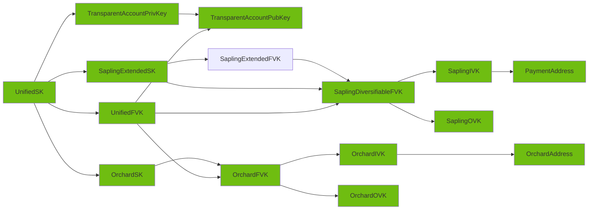

## Completion map

We currently have implemented and tested the following object graph:

* See API surface section below to see the API detailed status.

## FFI API features matrix

This is a feature matrix which keeps track of the current state of implementation for the FFI API surface. Here are the descriptions of each column:

* `Object/Method name`: The listing of all the `pub` methods that could be implemented for FFI .
* `Score`: How important is nowadays this. Being.
  * :red_circle: Essential.
  * :large_blue_circle: Nice to have.
  * :white_circle: Not interesting.
  *  If they do not have colour, evaluation is still needed.
* `UDL`:  The code is present in the Mozilla `UDL` file.
* `Code`: If theres an existing implementation in the Rust wrapper code.
* `Test`: Theres test coverage for this element. Directly or indirectly.
* `Docs`: If there is function level documentation in the `FFI` code, which later will be automatically generated bindings for all languages ([we are working on it](https://github.com/eigerco/uniffi-rs/issues)). See format to be followed [here](https://github.com/eigerco/uniffi-rs/issues/5#issuecomment-1436618667).

**Notes** :

* This should be kept up to date with new developments/findings.
* Its still in progress the creation of new types for `Orchard` below in this index.

### ZcashAccountPrivKey

* Original type: [zcash_primitives::legacy::keys::AccountPrivKey](https://docs.rs/zcash_primitives/0.10.0/zcash_primitives/legacy/keys/struct.AccountPrivKey.html)

| Object/Method name                                                                          |    Score     |        UDL         |        Code        |       Tests        | Docs  |
| ------------------------------------------------------------------------------------------- | :----------: | :----------------: | :----------------: | :----------------: | :---: |
| ZcashAccountPrivKey::from_seed()                                                            | :red_circle: | :white_check_mark: | :white_check_mark: | :white_check_mark: |       |
| ZcashAccountPrivKey::from_extended_privkey([ZcashExtendedPrivKey](#zcashextendedprivkey))   | :red_circle: | :white_check_mark: | :white_check_mark: |                    |       |
| ZcashAccountPrivKey::to_account_pubkey()                                                    | :red_circle: | :white_check_mark: | :white_check_mark: |                    |       |
| ZcashAccountPrivKey::derive_external_secret_key() -> [SecpSecretKey](#secpsecretkey)        | :red_circle: | :white_check_mark: | :white_check_mark: |                    |       |
| ZcashAccountPrivKey::derive_internal_secret_key() -> [SecpSecretKey](#secpsecretkey)        | :red_circle: | :white_check_mark: | :white_check_mark: |                    |       |
| ZcashAccountPrivKey::to_bytes()                                                             | :red_circle: | :white_check_mark: | :white_check_mark: | :white_check_mark: |       |
| ZcashAccountPrivKey::from_bytes()                                                           | :red_circle: | :white_check_mark: | :white_check_mark: |                    |       |

### SecpSecretKey

* Original type: [secp256k1::SecretKey](https://docs.rs/secp256k1/0.27.0/secp256k1/struct.SecretKey.html)

:warning: This type does not belong to the zcash API, but its returned from some methods. We are just providing support for serialization, so the user can deserialize the secret by making use of another `secp256k1` library in their specific language.

| Object/Method name                 |     Score      |        UDL         |        Code        | Tests |        Docs        |
| ---------------------------------- | :------------: | :----------------: | :----------------: | :---: | :----------------: |
| SecpSecretKey::new()               | :white_circle: |                    |                    |       |                    |
| SecpSecretKey::display_secret()    | :white_circle: |                    |                    |       |                    |
| SecpSecretKey::non_secure_erase()  | :white_circle: |                    |                    |       |                    |
| SecpSecretKey::from_slice()        |  :red_circle:  | :white_check_mark: | :white_check_mark: |       | :white_check_mark: |
| SecpSecretKey::serialize_secret()  |  :red_circle:  | :white_check_mark: | :white_check_mark: |       | :white_check_mark: |
| SecpSecretKey::from_keypair()      | :white_circle: |                    |                    |       |                    |
| SecpSecretKey::from_hashed_data()  | :white_circle: |                    |                    |       |                    |
| SecpSecretKey::secret_bytes()      | :white_circle: |                    |                    |       |                    |
| SecpSecretKey::negate()            | :white_circle: |                    |                    |       |                    |
| SecpSecretKey::add_tweak()         | :white_circle: |                    |                    |       |                    |
| SecpSecretKey::mul_tweak()         | :white_circle: |                    |                    |       |                    |
| SecpSecretKey::negate_assign()     | :white_circle: |                    |                    |       |                    |
| SecpSecretKey::add_assign()        | :white_circle: |                    |                    |       |                    |
| SecpSecretKey::mul_assign()        | :white_circle: |                    |                    |       |                    |
| SecpSecretKey::sign_ecdsa()        | :white_circle: |                    |                    |       |                    |
| SecpSecretKey::keypair()           | :white_circle: |                    |                    |       |                    |
| SecpSecretKey::public_key()        | :white_circle: |                    |                    |       |                    |
| SecpSecretKey::x_only_public_key() | :white_circle: |                    |                    |       |                    |

### ZcashExtendedPrivKey

* Original type: [hdwallet::extended_key::ExtendedPrivKey](https://docs.rs/hdwallet/latest/hdwallet/extended_key/struct.ExtendedPrivKey.html)

| Object/Method name                            |    Score     |        UDL         |        Code        |       Tests        |        Docs        |
| --------------------------------------------- | :----------: | :----------------: | :----------------: | :----------------: | :----------------: |
| ZcashExtendedPrivKey::random()                |              | :white_check_mark: | :white_check_mark: |                    | :white_check_mark: |
| ZcashExtendedPrivKey::random_with_seed_size() |              | :white_check_mark: | :white_check_mark: |                    | :white_check_mark: |
| ZcashExtendedPrivKey::with_seed()             | :red_circle: | :white_check_mark: | :white_check_mark: | :white_check_mark: | :white_check_mark: |
| ZcashExtendedPrivKey::derive_private_key()    |              | :white_check_mark: | :white_check_mark: |                    | :white_check_mark: |

### ZcashAccountPubKey

* Original type: [zcash_primitives::legacy::keys::AccountPubKey](https://docs.rs/zcash_primitives/0.10.0/zcash_primitives/legacy/keys/struct.AccountPubKey.html)

| Object/Method name                                                  | Score |        UDL         |        Code        | Tests |        Docs        |
| ------------------------------------------------------------------- | :---: | :----------------: | :----------------: | :---: | :----------------: |
| ZcashAccountPubKey::derive_external_ivk()                           |   🔴   | :white_check_mark: | :white_check_mark: |       | :white_check_mark: |
| ZcashAccountPubKey::derive_internal_ivk()                           |   🔴   | :white_check_mark: | :white_check_mark: |       | :white_check_mark: |
| ZcashAccountPubKey::ovks_for_shielding()                            |   🔴   | :white_check_mark: | :white_check_mark: |       | :white_check_mark: |
| ZcashAccountPubKey::internal_ovk()                                  |   🔴   | :white_check_mark: | :white_check_mark: |       | :white_check_mark: |
| ZcashAccountPubKey::external_ovk()                                  |   🔴   | :white_check_mark: | :white_check_mark: |       | :white_check_mark: |
| ZcashAccountPubKey::serialize()                                     |   🔴   | :white_check_mark: | :white_check_mark: |       | :white_check_mark: |
| ZcashAccountPubKey::deserialize() (renamed to new() as constructor) |   🔴   | :white_check_mark: | :white_check_mark: |       | :white_check_mark: |

### ZcashUnifiedSpendingKey

* Original type: [zcash_client_backend::keys::UnifiedSpendingKey]()

| Object/Method name                                                                                                    |    Score     |        UDL         |        Code        |       Tests        |        Docs        |
| --------------------------------------------------------------------------------------------------------------------- | :----------: | :----------------: | :----------------: | :----------------: | :----------------: |
| ZcashUnifiedSpendingKey::from_seed()                                                                                  | :red_circle: | :white_check_mark: | :white_check_mark: | :white_check_mark: | :white_check_mark: |
| ZcashUnifiedSpendingKey::to_unified_full_viewing_key() -> [ZcashUnifiedFullViewingKey](#zcashunifiedfullviewingkey)   | :red_circle: | :white_check_mark: | :white_check_mark: | :white_check_mark: | :white_check_mark: |
| ZcashUnifiedSpendingKey::transparent() -> [ZcashAccountPrivKey](#zcashaccountprivkey)                                                                                | :red_circle: | :white_check_mark: | :white_check_mark: |                    | :white_check_mark: |
| ZcashUnifiedSpendingKey::sapling() -> [ZcashExtendedSpendingKey](#zcashextendedspendingkey-sapling)                                                                                    | :red_circle: | :white_check_mark: | :white_check_mark: |                    | :white_check_mark: |
| ZcashUnifiedSpendingKey::orchard() -> [ZcashOrchardSpendingKey](#zcashorchardspendingkey)                                                                                    | :red_circle: | :white_check_mark: | :white_check_mark: |                    | :white_check_mark: |
| ZcashUnifiedSpendingKey::to_bytes()                                                                                | :red_circle: | :white_check_mark: | :white_check_mark: | :white_check_mark: | :white_check_mark: |
| ZcashUnifiedSpendingKey::from_bytes()                                                                                 |              | :white_check_mark: | :white_check_mark: | :white_check_mark: | :white_check_mark: |

### ZcashUnifiedFullViewingKey

* Original type: [zcash_client_backend::keys::UnifiedFullViewingKey]()

| Object/Method name                                                                                                                 |    Score     |        UDL         |        Code        |       Tests        |        Docs        |
| ---------------------------------------------------------------------------------------------------------------------------------- | :----------: | :----------------: | :----------------: | :----------------: | :----------------: |
| ZcashUnifiedFullViewingKey::new()                                                                                                  |              | :white_check_mark: | :white_check_mark: |                    | :white_check_mark: |
| ZcashUnifiedFullViewingKey::decode()                                                                                               | :red_circle: | :white_check_mark: | :white_check_mark: |                    | :white_check_mark: |
| ZcashUnifiedFullViewingKey::encode()                                                                                               | :red_circle: | :white_check_mark: | :white_check_mark: | :white_check_mark: | :white_check_mark: |
| ZcashUnifiedFullViewingKey::transparent() -> [ZcashAccountPubKey](#zcashaccountpubkey)                                             | :red_circle: | :white_check_mark: | :white_check_mark: |                    | :white_check_mark: |
| ZcashUnifiedFullViewingKey::sapling() -> [ZcashDiversifiableFullViewingKey](#zcashdiversifiablefullviewingkey-sapling)             | :red_circle: | :white_check_mark: | :white_check_mark: | :white_check_mark: | :white_check_mark: |
| ZcashUnifiedFullViewingKey::orchard() -> [ZcashOrchardFullViewingKey](#zcashorchardfullviewingkey)                                 | :red_circle: | :white_check_mark: | :white_check_mark: | :white_check_mark: | :white_check_mark: |
| ZcashUnifiedFullViewingKey::address() -> [ZcashUnifiedAddress](#zcashunifiedaddress)                                               |              | :white_check_mark: | :white_check_mark: |                    | :white_check_mark: |
| ZcashUnifiedFullViewingKey::find_address() -> [ZcashUnifiedAddressAndDiversifierIndex](#zcashunifiedaddressanddiversifierindex)    |              | :white_check_mark: | :white_check_mark: |                    | :white_check_mark: |
| ZcashUnifiedFullViewingKey::default_address() -> [ZcashUnifiedAddressAndDiversifierIndex](#zcashunifiedaddressanddiversifierindex) |              | :white_check_mark: | :white_check_mark: |                    | :white_check_mark: |

### ZcashUnifiedAddress

* Original type: [zcash_client_backend::address::UnifiedAddress](https://docs.rs/zcash_client_backend/latest/zcash_client_backend/address/struct.UnifiedAddress.html)

| Object/Method name                                                                        |    Score     |        UDL         |        Code        |       Tests        |        Docs        |
| ----------------------------------------------------------------------------------------- | :----------: | :----------------: | :----------------: | :----------------: | :----------------: |
| ZcashUnifiedAddress::new()                                                                | :red_circle: | :white_check_mark: | :white_check_mark: | :white_check_mark: | :white_check_mark: |
| ZcashUnifiedAddress::orchard() -> [ZcashOrchardAddress](#zcashorchardaddress)             | :red_circle: | :white_check_mark: | :white_check_mark: | :white_check_mark: | :white_check_mark: |
| ZcashUnifiedAddress::sapling()-> [ZcashPaymentAddress](#zcashpaymentaddress-sapling)      | :red_circle: | :white_check_mark: | :white_check_mark: | :white_check_mark: | :white_check_mark: |
| ZcashUnifiedAddress::transparent() -> [ZcashTransparentAddress](#zcashtransparentaddress) | :red_circle: | :white_check_mark: | :white_check_mark: | :white_check_mark: | :white_check_mark: |
| ZcashUnifiedAddress::decode()                                                             | :red_circle: | :white_check_mark: | :white_check_mark: | :white_check_mark: | :white_check_mark: |
| ZcashUnifiedAddress::encode()                                                             | :red_circle: | :white_check_mark: | :white_check_mark: | :white_check_mark: | :white_check_mark: |

### ZcashRecipientAddress

* Original type: [zcash_client_backend::address::RecipientAddress](https://docs.rs/zcash_client_backend/latest/zcash_client_backend/address/enum.RecipientAddress.html)

| Object/Method name                           |    Score     |        UDL         |        Code        |       Tests        |        Docs        |
| -------------------------------------------- | :----------: | :----------------: | :----------------: | :----------------: | :----------------: |
| ZcashRecipientAddress::shielded()            | :red_circle: | :white_check_mark: | :white_check_mark: | :white_check_mark: | :white_check_mark: |
| ZcashRecipientAddress::transparent()         | :red_circle: | :white_check_mark: | :white_check_mark: | :white_check_mark: | :white_check_mark: |
| ZcashRecipientAddress::unified()             | :red_circle: | :white_check_mark: | :white_check_mark: | :white_check_mark: | :white_check_mark: |
| ZcashRecipientAddress::decode()              | :red_circle: | :white_check_mark: | :white_check_mark: |                    | :white_check_mark: |
| ZcashRecipientAddress::encode()              | :red_circle: | :white_check_mark: | :white_check_mark: | :white_check_mark: | :white_check_mark: |

### ZcashTransparentAddress

* Original type: [zcash_primitives::legacy::TransparentAddress](https://docs.rs/zcash_primitives/latest/zcash_primitives/legacy/enum.TransparentAddress.html)

| Object/Method name                             |    Score     |        UDL         |        Code        |       Tests        |        Docs        |
| ---------------------------------------------- | :----------: | :----------------: | :----------------: | :----------------: | :----------------: |
| ZcashTransparentAddress::public_key()          | :red_circle: | :white_check_mark: | :white_check_mark: | :white_check_mark: | :white_check_mark: |
| ZcashTransparentAddress::script()              | :red_circle: | :white_check_mark: | :white_check_mark: | :white_check_mark: | :white_check_mark: |
| ZcashTransparentAddress::decode()              | :red_circle: | :white_check_mark: | :white_check_mark: | :white_check_mark: | :white_check_mark: |
| ZcashTransparentAddress::encode()              | :red_circle: | :white_check_mark: | :white_check_mark: | :white_check_mark: | :white_check_mark: |
| ZcashTransparentAddress::is_public_key()       | :red_circle: | :white_check_mark: | :white_check_mark: | :white_check_mark: | :white_check_mark: |
| ZcashTransparentAddress::is_secret()           | :red_circle: | :white_check_mark: | :white_check_mark: | :white_check_mark: | :white_check_mark: |
| ZcashTransparentAddress::to_bytes()            | :red_circle: | :white_check_mark: | :white_check_mark: | :white_check_mark: | :white_check_mark: |

### ZcashDiversifiableFullViewingKey (Sapling)

* Original type: [zcash_client_backend::keys::sapling::DiversifiableFullViewingKey](https://docs.rs/zcash_client_backend/latest/zcash_client_backend/keys/sapling/struct.DiversifiableFullViewingKey.html)

| Object/Method name                                                                                                                         |    Score     |        UDL         |        Code        |       Tests        |         Docs       |
| ------------------------------------------------------------------------------------------------------------------------------------------ | :----------: | :----------------: | :----------------: | :----------------: | :----------------: |
| ZcashDiversifiableFullViewingKey::from_bytes()                                                                                             | :red_circle: | :white_check_mark: | :white_check_mark: |                    | :white_check_mark: |
| ZcashDiversifiableFullViewingKey::to_bytes()                                                                                               | :red_circle: | :white_check_mark: | :white_check_mark: |                    | :white_check_mark: |
| ZcashDiversifiableFullViewingKey::fvk() -> [ZcashFullViewingKey](#zcashfullviewingkey-sapling)                                             | :red_circle: | :white_check_mark: | :white_check_mark: |                    | :white_check_mark: |
| ZcashDiversifiableFullViewingKey::to_nk() -> [ZcashNullifierDerivingKey](#zcashnullifierderivingkey-sapling)                               | :red_circle: | :white_check_mark: | :white_check_mark: |                    | :white_check_mark: |
| ZcashDiversifiableFullViewingKey::to_ivk() -> [ZcashSaplingIvk](#zcashsaplingivk-sapling)                                                  | :red_circle: | :white_check_mark: | :white_check_mark: | :white_check_mark: | :white_check_mark: |
| ZcashDiversifiableFullViewingKey::to_ovk() -> [ZcashOutgoingViewingKey](#zcashoutgoingviewingkey-sapling)                                  | :red_circle: | :white_check_mark: | :white_check_mark: |                    | :white_check_mark: |
| ZcashDiversifiableFullViewingKey::address() -> [ZcashPaymentAddress](#zcashpaymentaddress-sapling)                                         | :red_circle: | :white_check_mark: | :white_check_mark: |                    | :white_check_mark: |
| ZcashDiversifiableFullViewingKey::find_address() -> [ZcashDiversifierIndexAndPaymentAddress](#zcashdiversifierindexandpaymentaddress)      | :red_circle: | :white_check_mark: | :white_check_mark: |                    | :white_check_mark: |
| ZcashDiversifiableFullViewingKey::default_address() -> [ZcashDiversifierIndexAndPaymentAddress](#zcashdiversifierindexandpaymentaddress)   | :red_circle: | :white_check_mark: | :white_check_mark: |                    | :white_check_mark: |
| ZcashDiversifiableFullViewingKey::diversified_address() -> [ZcashPaymentAddress](#zcashpaymentaddress-sapling)                             | :red_circle: | :white_check_mark: | :white_check_mark: |                    | :white_check_mark: |
| ZcashDiversifiableFullViewingKey::change_address() -> [ZcashDiversifierIndexAndPaymentAddress](#zcashdiversifierindexandpaymentaddress)    | :red_circle: | :white_check_mark: | :white_check_mark: |                    | :white_check_mark: |
| ZcashDiversifiableFullViewingKey::diversified_change_address() -> [ZcashPaymentAddress](#zcashpaymentaddress-sapling)                      | :red_circle: | :white_check_mark: | :white_check_mark: |                    | :white_check_mark: |
| ZcashDiversifiableFullViewingKey::decrypt_diversifier() -> [ZcashDiversifierIndexAndScope](#zcashdiversifierindexandscope)                 | :red_circle: | :white_check_mark: | :white_check_mark: |                    | :white_check_mark: |

### ZcashExtendedSpendingKey (Sapling)

* Original type: [zcash_primitives::zip32::sapling::ExtendedSpendingKey](https://docs.rs/zcash_primitives/0.10.0/zcash_primitives/zip32/sapling/struct.ExtendedSpendingKey.html)

| Object/Method name                                            |    Score     |        UDL         |        Code        |       Tests        | Docs  |
| ------------------------------------------------------------- | :----------: | :----------------: | :----------------: | :----------------: | :---: |
| ZcashExtendedSpendingKey::master()                            | :red_circle: | :white_check_mark: | :white_check_mark: | :white_check_mark: |       |
| ZcashExtendedSpendingKey::from_bytes()                        | :red_circle: | :white_check_mark: | :white_check_mark: | :white_check_mark: |       |
| ZcashExtendedSpendingKey::read()                              |              |                    |                    |                    |       |
| ZcashExtendedSpendingKey::to_bytes()                          | :red_circle: | :white_check_mark: | :white_check_mark: | :white_check_mark: |       |
| ZcashExtendedSpendingKey::write()                             |              |                    |                    |                    |       |
| ZcashExtendedSpendingKey::from_path()                         | :red_circle: | :white_check_mark: | :white_check_mark: | :white_check_mark: |       |
| ZcashExtendedSpendingKey::derive_child()                      | :red_circle: | :white_check_mark: | :white_check_mark: | :white_check_mark: |       |
| ZcashExtendedSpendingKey::default_address()                   | :red_circle: | :white_check_mark: | :white_check_mark: | :white_check_mark: |       |
| ZcashExtendedSpendingKey::derive_internal()                   | :red_circle: | :white_check_mark: | :white_check_mark: | :white_check_mark: |       |
| ZcashExtendedSpendingKey::to_extended_full_viewing_key()      |              |                    |                    |                    |       |
| ZcashExtendedSpendingKey::to_diversifiable_full_viewing_key() | :red_circle: | :white_check_mark: | :white_check_mark: | :white_check_mark: |       |

### ZcashSaplingIvk (Sapling)

* Original type: [zcash_primitives::sapling::SaplingIvk](https://docs.rs/zcash_primitives/0.10.0/zcash_primitives/sapling/index.html#reexport.SaplingIvk)

| Object/Method name                                                                                                       |    Score     |        UDL         |        Code        |       Tests        | Docs  |
| ------------------------------------------------------------------------------------------------------------------------ | :----------: | :----------------: | :----------------: | :----------------: | :---: |
| ::to_payment_address([ZcashDiversifier](###ZcashDiversifier)) -> [ZcashPaymentAddress](#zcashpaymentaddress-sapling)     | :red_circle: | :white_check_mark: | :white_check_mark: | :white_check_mark: |       |
| ZcashSaplingIvk::to_repr()                                                                                               |              | :white_check_mark: | :white_check_mark: |                    |       |

### ZcashDiversifier (Sapling)

* Original type: [zcash_primitives::sapling::Diversifier](https://docs.rs/zcash_primitives/latest/zcash_primitives/sapling/keys/struct.Diversifier.html)

| Object/Method name      |    Score     |        UDL         |        Code        |       Tests        | Docs  |
| ----------------------- | :----------: | :----------------: | :----------------: | :----------------: | :---: |
| ::new()                 | :red_circle: | :white_check_mark: | :white_check_mark: | :white_check_mark: |       |
| ZcashDiversifier::g_d() |              |                    |                    |                    |       |

### ZcashExpandedSpendingKey (Sapling)

* Original type: [zcash_primitives::sapling::keys::ExpandedSpendingKey](https://docs.rs/zcash_primitives/latest/zcash_primitives/sapling/keys/struct.ExpandedSpendingKey.html)

| Object/Method name                                                                                                  |    Score     |        UDL         |        Code        |       Tests        |        Docs        |
| ------------------------------------------------------------------------------------------------------------------- | :----------: | :----------------: | :----------------: | :----------------: | :----------------: |
| ZcashExpandedSpendingKey::from_spending_key()                                                                       | :red_circle: | :white_check_mark: | :white_check_mark: |                    | :white_check_mark: |
| ZcashExpandedSpendingKey::from_bytes()                                                                              | :red_circle: | :white_check_mark: | :white_check_mark: |                    | :white_check_mark: |
| ZcashExpandedSpendingKey::proof_generation_key() -> [ZcashProofGenerationKey](#zcashproofgenerationkey-sapling)     | :red_circle: | :white_check_mark: | :white_check_mark: |                    | :white_check_mark: |
| ZcashExpandedSpendingKey::to_bytes()                                                                                | :red_circle: | :white_check_mark: | :white_check_mark: |                    | :white_check_mark: |

### ZcashFullViewingKey (Sapling)

* Original type: [zcash_primitives::sapling::keys::FullViewingKey](https://docs.rs/zcash_primitives/latest/zcash_primitives/sapling/keys/struct.FullViewingKey.html)

| Object/Method name                                                                            |    Score     |        UDL         |        Code        |       Tests        |        Docs        |
| --------------------------------------------------------------------------------------------- | :----------: | :----------------: | :----------------: | :----------------: | :----------------: |
| ZcashFullViewingKey::from_bytes()                                                             | :red_circle: | :white_check_mark: | :white_check_mark: |                    | :white_check_mark: |
| ZcashFullViewingKey::from_expanded_spending_key()                                             | :red_circle: | :white_check_mark: | :white_check_mark: |                    | :white_check_mark: |
| ZcashFullViewingKey::to_bytes()                                                               | :red_circle: | :white_check_mark: | :white_check_mark: |                    | :white_check_mark: |
| ZcashFullViewingKey::vk() -> [ZcashViewingKey](#zcashviewingkey-sapling)                      | :red_circle: | :white_check_mark: | :white_check_mark: |                    | :white_check_mark: |
| ZcashFullViewingKey::ovk() -> [ZcashOutgoingViewingKey](#zcashoutgoingviewingkey-sapling)     | :red_circle: | :white_check_mark: | :white_check_mark: |                    | :white_check_mark: |

### ZcashNullifierDerivingKey (Sapling)

* Original type: [zcash_primitives::sapling::keys::NullifierDerivingKey](https://docs.rs/zcash_primitives/latest/zcash_primitives/sapling/keys/struct.NullifierDerivingKey.html)

`NullifierDerivingKey` is a wrapper around [jubjub](https://docs.rs/jubjub/latest/jubjub/)'s `SubgroupPoint` -
exposing `jubjub` types is beyond the scope of this project.

### ZcashProofGenerationKey (Sapling)

* Original type: [zcash_primitives::sapling::keys::ProofGenerationKey](https://docs.rs/zcash_primitives/latest/zcash_primitives/sapling/keys/struct.ProofGenerationKey.html)

| Object/Method name                                                                           |    Score     |        UDL         |        Code        |       Tests        |        Docs        |
| -------------------------------------------------------------------------------------------- | :----------: | :----------------: | :----------------: | :----------------: | :----------------: |
| ZcashProofGenerationKey::to_viewing_key() -> [ZcashViewingKey](#zcashviewingkey-sapling)     | :red_circle: | :white_check_mark: | :white_check_mark: |                    | :white_check_mark: |

### ZcashViewingKey (Sapling)

* Original type: [zcash_primitives::sapling::keys::ViewingKey](https://docs.rs/zcash_primitives/latest/zcash_primitives/sapling/keys/struct.ViewingKey.html)

| Object/Method name                                                                               |    Score     |        UDL         |        Code        |       Tests        |        Docs        |
| ------------------------------------------------------------------------------------------------ | :----------: | :----------------: | :----------------: | :----------------: | :----------------: |
| ZcashViewingKey::ivk() -> [ZcashSaplingIvk](#zcashsaplingivk-sapling)                            | :red_circle: | :white_check_mark: | :white_check_mark: |                    | :white_check_mark: |
| ZcashViewingKey::to_payment_address() -> [ZcashPaymentAddress](#zcashpaymentaddress-sapling)     | :red_circle: | :white_check_mark: | :white_check_mark: |                    | :white_check_mark: |

### ZcashOutgoingViewingKey (Sapling)

Original type: [zcash_primitives::sapling::keys::OutgoingViewingKey](https://docs.rs/zcash_primitives/latest/zcash_primitives/sapling/keys/struct.OutgoingViewingKey.html)

| Object/Method name                    |    Score     |        UDL         |        Code        |       Tests        |        Docs        |
| ------------------------------------- | :----------: | :----------------: | :----------------: | :----------------: | :----------------: |
| ZcashOutgoingViewingKey::from_bytes() |              | :white_check_mark: | :white_check_mark: |                    | :white_check_mark: |
| ZcashOutgoingViewingKey::to_bytes()   | :red_circle: | :white_check_mark: | :white_check_mark: | :white_check_mark: | :white_check_mark: |

### ZcashPaymentAddress (Sapling)

* Original type: [zcash_primitives::sapling::PaymentAddress](https://docs.rs/zcash_primitives/latest/zcash_primitives/sapling/struct.PaymentAddress.html)

| Object/Method name                 |    Score        |        UDL         |        Code        |       Tests        | Docs  |
| ---------------------------------- | :----------:    | :----------------: | :----------------: | :----------------: | :---: |
| ZcashPaymentAddress::from_parts()  | :red_circle: |                    |                    |                    |       |
| ZcashPaymentAddress::from_bytes()  | :red_circle:                |                    |                    |                    |       |
| ZcashPaymentAddress::to_bytes()    | :red_circle: | :white_check_mark: | :white_check_mark: | :white_check_mark: |       |
| ZcashPaymentAddress::diversifier() | :red_circle: | :white_check_mark: | :white_check_mark: |                       |  :white_check_mark:     |
| ZcashPaymentAddress::pk_d()        | :red_circle: | :white_check_mark: | :white_check_mark: |                       |   :white_check_mark:    |
| ZcashPaymentAddress::create_note() | :red_circle: |  :white_check_mark:| :white_check_mark: |                        |  :white_check_mark:     |

### ZcashSaplingNote

* Original type: [zcash_primitives::sapling::Note](https://docs.rs/zcash_primitives/0.10.2/zcash_primitives/sapling/note/struct.Note.html)

| Object/Method name                 |    Score        |        UDL         |        Code        |       Tests        | Docs  |
| ---------------------------------- | :----------:    | :----------------: | :----------------: | :----------------: | :---: |
| ZcashSaplingNote::from_parts()  | :red_circle:  | :white_check_mark: | :white_check_mark:  |                    |  :white_check_mark:     |
| ZcashSaplingNote::recipient()   |                  |                    |                    |                    |       |
| ZcashSaplingNote::value()       |                  |                    |                    |                    |       |
| ZcashSaplingNote::rseed()       |                  |                    |                    |                    |       |
| ZcashSaplingNote::nf()          |                  |                    |                    |                    |       |
| ZcashSaplingNote::cmu()          |  :red_circle: |  :white_check_mark:                  |    :white_check_mark:                |                    |    :white_check_mark:   |
| ZcashSaplingNote::rcm()          |                  |                    |                    |                    |       |
| ZcashSaplingNote::generate_or_derive_esk()  |                  |                    |                    |          |       |

### ZcashSaplingExtractedNoteCommitment

* Original type: [zcash_primitives::sapling::note::ExtractedNoteCommitment](https://docs.rs/zcash_primitives/0.10.2/zcash_primitives/sapling/note/struct.ExtractedNoteCommitment.html)

| Object/Method name                 |    Score        |        UDL         |        Code        |       Tests        | Docs  |
| ---------------------------------- | :----------:    | :----------------: | :----------------: | :----------------: | :---: |
| ZcashSaplingExtractedNoteCommitment::from_bytes()  | :red_circle:  | :white_check_mark: | :white_check_mark:  |        |  :white_check_mark:     |
| ZcashSaplingExtractedNoteCommitment::to_bytes()  | :red_circle:  | :white_check_mark: | :white_check_mark:  |          |  :white_check_mark:     |

### ZcashSaplingNoteValue

* Original type: [zcash_primitives::sapling::value::NoteValue](https://docs.rs/zcash_primitives/0.10.2/zcash_primitives/sapling/value/struct.NoteValue.html)

| Object/Method name                 |    Score        |        UDL         |        Code        |       Tests        | Docs  |
| ---------------------------------- | :----------:    | :----------------: | :----------------: | :----------------: | :---: |
| ZcashSaplingNoteValue::inner()  | :red_circle:  | :white_check_mark: | :white_check_mark:  |                    |  :white_check_mark:     |
| ZcashSaplingNoteValue::from_raw()  | :red_circle:  | :white_check_mark: | :white_check_mark:  |                    |  :white_check_mark:     |

### ZcashSaplingDiversifiedTransmissionKey

* Original type: [zcash_primitives::sapling::keys::DiversifiedTransmissionKey](https://docs.rs/zcash_primitives/0.10.2/zcash_primitives/sapling/keys/struct.DiversifiedTransmissionKey.html)

| Object/Method name                 |    Score        |        UDL         |        Code        |       Tests        | Docs  |
| ---------------------------------- | :----------:    | :----------------: | :----------------: | :----------------: | :---: |
| ZcashSaplingDiversifiedTransmissionKey::from_parts()  | :red_circle:  | :white_check_mark: | :white_check_mark:  |                    |  :white_check_mark:     |

### ZcashOrchardSpendingKey

* Original type: [orchard::keys::SpendingKey](https://docs.rs/orchard/0.3.0/orchard/keys/struct.SpendingKey.html)

| Object/Method name                         | Score        | UDL                | Code               | Tests              | Docs |
| ------------------------------------------ | ------------ | ------------------ | ------------------ | ------------------ | ---- |
| ZcashOrchardSpendingKey::to_bytes()        | :red_circle: | :white_check_mark: | :white_check_mark: | :white_check_mark: |      |
| ZcashOrchardSpendingKey::from_zip32_seed() | :red_circle: | :white_check_mark: | :white_check_mark: | :white_check_mark: |      |
| ZcashOrchardSpendingKey::from_bytes()      | :red_circle: | :white_check_mark: | :white_check_mark: | :white_check_mark: |      |
| ZcashOrchardSpendingKey::to_fvk()          | :red_circle: | :white_check_mark: | :white_check_mark: |             |  :white_check_mark: |

### ZcashOrchardFullViewingKey

* Original type: [orchard::keys::FullViewingKey](https://docs.rs/orchard/0.3.0/orchard/keys/struct.FullViewingKey.html)

| Object/Method name                                                                                          | Score        | UDL                | Code               | Tests              | Docs               |
| ----------------------------------------------------------------------------------------------------------- | ------------ | ------------------ | ------------------ | ------------------ | ------------------ |
| ZcashOrchardFullViewingKey::address_at() -> [ZcashOrchardAddress](#zcashorchardaddress)                     |              | :white_check_mark: | :white_check_mark: |                    | :white_check_mark: |
| ZcashOrchardFullViewingKey::address() -> [ZcashOrchardAddress](#zcashorchardaddress)                        |              | :white_check_mark: | :white_check_mark: |                    | :white_check_mark: |
| ZcashOrchardFullViewingKey::scope_for_address() -> [ZcashOrchardScope](#zcashorchardscope)                  |              | :white_check_mark: | :white_check_mark: |                    | :white_check_mark: |
| ZcashOrchardFullViewingKey::to_bytes()                                                                      |              | :white_check_mark: | :white_check_mark: |                    | :white_check_mark: |
| ZcashOrchardFullViewingKey::from_bytes()                                                                    |              | :white_check_mark: | :white_check_mark: |                    | :white_check_mark: |
| ZcashOrchardFullViewingKey::to_ivk() -> [ZcashOrchardIncomingViewingKey](#zcashorchardincomingviewingkey)   | :red_circle: | :white_check_mark: | :white_check_mark: | :white_check_mark: | :white_check_mark: |
| ZcashOrchardFullViewingKey::to_ovk() -> [ZcashOrchardOutgoingViewingKey](#zcashorchardoutgoingviewingkey)   | :red_circle: | :white_check_mark: | :white_check_mark: | :white_check_mark: | :white_check_mark: |

### ZcashOrchardIncomingViewingKey

* Original type: [orchard::keys::IncomingViewingKey](https://docs.rs/orchard/0.3.0/orchard/keys/struct.IncomingViewingKey.html)

| Object/Method name                                                                                                                            | Score        | UDL                | Code               | Tests              | Docs               |
| --------------------------------------------------------------------------------------------------------------------------------------------- | ------------ | ------------------ | ------------------ | ------------------ | ------------------ |
| ZcashOrchardIncomingViewingKey::to_bytes()                                                                                                    | :red_circle: | :white_check_mark: | :white_check_mark: |                    | :white_check_mark: |
| ZcashOrchardIncomingViewingKey::from_bytes()                                                                                                  |              | :white_check_mark: | :white_check_mark: |                    | :white_check_mark: |
| ZcashOrchardIncomingViewingKey::diversifier_index() -> [ZcashOrchardDiversifierIndex](#zcashorcharddiversifierindex)                          |              | :white_check_mark: | :white_check_mark: |                    | :white_check_mark: |
| ZcashOrchardIncomingViewingKey::address_at() -> [ZcashOrchardAddress](#zcashorchardaddress)                                                   |              | :white_check_mark: | :white_check_mark: |                    | :white_check_mark: |
| ZcashOrchardIncomingViewingKey::address() -> [ZcashOrchardAddress](#zcashorchardaddress)                                                      | :red_circle: | :white_check_mark: | :white_check_mark: | :white_check_mark: | :white_check_mark: |

### ZcashOrchardOutgoingViewingKey

* Original type: [orchard::keys::OutgoingViewingKey](https://docs.rs/orchard/0.3.0/orchard/keys/struct.OutgoingViewingKey.html)
* Just a type, no pub methods

| Object/Method name | Score | UDL | Code | Tests | Docs |
| ------------------ | ----- | --- | ---- | ----- | ---- |

### ZcashOrchardAddress

* Original type: [orchard::Address](https://docs.rs/orchard/0.3.0/orchard/struct.Address.html)

| Object/Method name                                                                                  | Score        | UDL                | Code               | Tests              | Docs               |
| --------------------------------------------------------------------------------------------------- | ------------ | ------------------ | ------------------ | ------------------ | ------------------ |
| ZcashOrchardAddress::diversifier() -> [ZcashOrchardDiversifierIndex](#zcashorcharddiversifierindex) |              | :white_check_mark: | :white_check_mark: |                    | :white_check_mark: |
| ZcashOrchardAddress::to_raw_address_bytes()                                                         | :red_circle: | :white_check_mark: | :white_check_mark: | :white_check_mark: | :white_check_mark: |
| ZcashOrchardAddress::from_raw_address_bytes()                                                       |              | :white_check_mark: | :white_check_mark: |                    | :white_check_mark: |

### ZcashOrchardScope

* Original type: [orchard::keys::Scope](https://docs.rs/orchard/0.3.0/orchard/keys/enum.Scope.html)

| Members         | Score        | UDL                | Code               | Tests              | Docs               |
| --------------- | ------------ | ------------------ | ------------------ | ------------------ | ------------------ |
| External        |              | :white_check_mark: | :white_check_mark: | :white_check_mark: | :white_check_mark: |
| Internal        |              | :white_check_mark: | :white_check_mark: | :white_check_mark: | :white_check_mark: |

### ZcashOrchardDiversifierIndex

* Original type: [orchard::keys::DiversifierIndex](https://docs.rs/orchard/0.3.0/orchard/keys/struct.DiversifierIndex.html)

| Object/Method name                                     | Score        | UDL                | Code               | Tests              | Docs               |
| ------------------------------------------------------ | ------------ | ------------------ | ------------------ | ------------------ | ------------------ |
| ZcashOrchardDiversifierIndex::from_bytes()             |              | :white_check_mark: | :white_check_mark: |                    | :white_check_mark: |
| ZcashOrchardDiversifierIndex::from_u32()               |              | :white_check_mark: | :white_check_mark: |                    | :white_check_mark: |
| ZcashOrchardDiversifierIndex::from_u64()               |              | :white_check_mark: | :white_check_mark: |                    | :white_check_mark: |
| ZcashOrchardDiversifierIndex::to_bytes()               |              | :white_check_mark: | :white_check_mark: |                    | :white_check_mark: |

### ZcashDiversifierIndex

* Original type: [zcash_primitives::zip32::DiversifierIndex](https://docs.rs/zcash_primitives/latest/zcash_primitives/zip32/struct.DiversifierIndex.html)

| Object/Method name                              | Score        | UDL                | Code               | Tests              | Docs               |
| ----------------------------------------------- | ------------ | ------------------ | ------------------ | ------------------ | ------------------ |
| ZcashDiversifierIndex::new()                    |              | :white_check_mark: | :white_check_mark: |                    | :white_check_mark: |
| ZcashDiversifierIndex::from_u32()               |              | :white_check_mark: | :white_check_mark: |                    | :white_check_mark: |
| ZcashDiversifierIndex::from_u64()               |              | :white_check_mark: | :white_check_mark: |                    | :white_check_mark: |
| ZcashDiversifierIndex::increment()              |              | :white_check_mark: | :white_check_mark: |                    | :white_check_mark: |
| ZcashDiversifierIndex::to_u32()                 |              | :white_check_mark: | :white_check_mark: |                    | :white_check_mark: |
| ZcashDiversifierIndex::to_bytes()               |              | :white_check_mark: | :white_check_mark: |                    | :white_check_mark: |

### ZcashKeyIndex

* Original type: [hdwallet::extended_key::key_index::KeyIndex](https://docs.rs/hdwallet/latest/hdwallet/extended_key/key_index/enum.KeyIndex.html)

| Object/Method name                              | Score        | UDL                | Code               | Tests              | Docs               |
| ----------------------------------------------- | ------------ | ------------------ | ------------------ | ------------------ | ------------------ |
| ZcashKeyIndex::from_u32()                       |              | :white_check_mark: | :white_check_mark: |                    | :white_check_mark: |
| ZcashKeyIndex::raw_index()                      |              | :white_check_mark: | :white_check_mark: |                    | :white_check_mark: |
| ZcashKeyIndex::normalize_index()                |              | :white_check_mark: | :white_check_mark: |                    | :white_check_mark: |
| ZcashKeyIndex::is_valid()                       |              | :white_check_mark: | :white_check_mark: |                    | :white_check_mark: |
| ZcashKeyIndex::hardened_from_normalize_index()  |              | :white_check_mark: | :white_check_mark: |                    | :white_check_mark: |
| ZcashKeyIndex::from_index()                     |              | :white_check_mark: | :white_check_mark: |                    | :white_check_mark: |

### ZcashScope

* Original type: [zcash_primitives::zip32::Scope](https://docs.rs/zcash_primitives/latest/zcash_primitives/zip32/enum.Scope.html)

| Members         | Score        | UDL                | Code               | Tests              | Docs               |
| --------------- | ------------ | ------------------ | ------------------ | ------------------ | ------------------ |
| External        |              | :white_check_mark: | :white_check_mark: | :white_check_mark: | :white_check_mark: |
| Internal        |              | :white_check_mark: | :white_check_mark: | :white_check_mark: | :white_check_mark: |

### ZcashKeySeed

* Original type: [hdwallet::extended_key::KeySeed](https://docs.rs/hdwallet/latest/hdwallet/extended_key/enum.KeySeed.html)

| Members         | Score        | UDL                | Code               | Tests              | Docs               |
| --------------- | ------------ | ------------------ | ------------------ | ------------------ | ------------------ |
| S128            |              | :white_check_mark: | :white_check_mark: |                    | :white_check_mark: |
| S256            |              | :white_check_mark: | :white_check_mark: |                    | :white_check_mark: |
| S512            |              | :white_check_mark: | :white_check_mark: |                    | :white_check_mark: |

### ZcashTransactionBuilder

* Original type: [zcash_primitives::transaction::builder::Builder](https://docs.rs/zcash_primitives/0.10.2/zcash_primitives/transaction/builder/struct.Builder.html)

| Members                                           | Score | UDL | Code | Tests | Docs |
| ------------------------------------------------- | ----- | --- | ---- | ----- | ---- |
| ZcashTransactionBuilder::test_only_new_with_rng() | ⚪     |     |      |       |      |
| ZcashTransactionBuilder::mock_build()             | ⚪     |     |      |       |      |
| ZcashTransactionBuilder::params()                 | 🔵     |     |      |       |      |
| ZcashTransactionBuilder::target_height()          | 🔵     |     |      |       |      |
| ZcashTransactionBuilder::transparent_inputs()     | 🔵     |     |      |       |      |
| ZcashTransactionBuilder::transparent_outputs()    | 🔵     |     |      |       |      |
| ZcashTransactionBuilder::sapling_inputs()         | 🔵     |     |      |       |      |
| ZcashTransactionBuilder::sapling_outputs()        | 🔵     |     |      |       |      |
| ZcashTransactionBuilder::new()                    | 🔴     |     |      |       |      |
| ZcashTransactionBuilder::new_with_rng()           | 🔵     |     |      |       |      |
| ZcashTransactionBuilder::add_sapling_spend()      | 🔴     |     |      |       |      |
| ZcashTransactionBuilder::add_sapling_output()     | 🔴     |     |      |       |      |
| ZcashTransactionBuilder::add_transparent_input()  | 🔴     |     |      |       |      |
| ZcashTransactionBuilder::add_transparent_output() | 🔴     |     |      |       |      |
| ZcashTransactionBuilder::with_progress_notifier() | 🔵     |     |      |       |      |
| ZcashTransactionBuilder::build()                  | 🔴     |     |      |       |      |
| ZcashTransactionBuilder::build_zfuture()          | 🔵     |     |      |       |      |

### ZcashParametersMainNetwork
* Original type: [zcash_primitives::consensus::MainNetwork](https://docs.rs/zcash_primitives/0.10.2/zcash_primitives/consensus/struct.MainNetwork.html)
* Marker struct, no need to implement methods.

| Members | Score | UDL | Code | Tests | Docs |
| ------- | ----- | --- | ---- | ----- | ---- |

### ZcashParametersTestNetwork
* Original type: [zcash_primitives::consensus::TestNetwork](https://docs.rs/zcash_primitives/0.10.2/zcash_primitives/consensus/struct.TestNetwork.html)
* Marker struct, no need to implement methods.

| Members | Score | UDL | Code | Tests | Docs |
| ------- | ----- | --- | ---- | ----- | ---- |

### ZcashBlockHeight

* Original type: [zcash_primitives::consensus::BlockHeight](https://docs.rs/zcash_primitives/0.10.2/zcash_primitives/consensus/struct.BlockHeight.html)

| Members                      | Score | UDL | Code | Tests | Docs |
| ---------------------------- | ----- | --- | ---- | ----- | ---- |
| ZcashBlockHeight::from_u32() | 🔴     |     |      |       |      |

### ZcashExternalIvk

* Original type: [zcash_primitives::legacy::keys::ExternalIvk](https://docs.rs/zcash_primitives/0.10.2/zcash_primitives/legacy/keys/struct.ExternalIvk.html)

| Members                            | Score | UDL | Code | Tests | Docs |
| ---------------------------------- | ----- | --- | ---- | ----- | ---- |
| ZcashExternalIvk::derive_address() | 🔴     |     |      |       |      |

### ZcashTransparentTxOut

* Original type: [zcash_primitives::transaction::components::transparent::TxOut](https://docs.rs/zcash_primitives/0.10.2/zcash_primitives/transaction/components/transparent/struct.TxOut.html)

| Members                                    | Score | UDL | Code | Tests | Docs |
| ------------------------------------------ | ----- | --- | ---- | ----- | ---- |
| ZcashTransparentTxOut::read()              | 🔵     |     |      |       |      |
| ZcashTransparentTxOut::write()             | 🔵     |     |      |       |      |
| ZcashTransparentTxOut::recipient_address() | 🔵     |     |      |       |      |

### ZcashScript

* Original type: [zcash_primitives::legacy::Script](https://docs.rs/zcash_primitives/0.10.2/zcash_primitives/legacy/struct.Script.html)

| Members                                    | Score | UDL | Code | Tests | Docs |
| ------------------------------------------ | ----- | --- | ---- | ----- | ---- |
| ZcashTransparentTxOut::read()              | 🔵     |     |      |       |      |
| ZcashTransparentTxOut::write()             | 🔵     |     |      |       |      |

### ZcashAmount

* Original type: [zcash_primitives::transaction::components::amount::Amount](https://docs.rs/zcash_primitives/0.10.2/zcash_primitives/transaction/components/amount/struct.Amount.html)

| Members                                      | Score | UDL | Code | Tests | Docs |
| -------------------------------------------- | ----- | --- | ---- | ----- | ---- |
| ZcashAmount::zero()                          | 🔴    | ✅  | ✅   |       | ✅   |
| ZcashAmount::from_i64()                      | 🔴    | ✅  | ✅   |       | ✅   |
| ZcashAmount::from_nonnegative_i64()          | 🔵    |     |      |       |      |
| ZcashAmount::from_u64()                      | 🔵    |     |      |       |      |
| ZcashAmount::from_i64_le_bytes()             | 🔵    |     |      |       |      |
| ZcashAmount::from_i64_le_bytes()             | 🔵    |     |      |       |      |
| ZcashAmount::from_nonnegative_i64_le_bytes() | 🔵    |     |      |       |      |
| ZcashAmount::from_i64_le_bytes()             | 🔵    |     |      |       |      |
| ZcashAmount::to_i64_le_bytes()               | 🔵    |     |      |       |      |
| ZcashAmount::is_positive()                   | 🔵    |     |      |       |      |
| ZcashAmount::is_negative()                   | 🔵    |     |      |       |      |
| ZcashAmount::sum()                           | 🔵    |     |      |       |      |

### ZcashOutPoint

* Original type: [zcash_primitives::transaction::components::transparent::OutPoint](https://docs.rs/zcash_primitives/0.10.2/zcash_primitives/transaction/components/transparent/struct.OutPoint.html)

| Members                           | Score | UDL | Code | Tests | Docs |
| --------------------------------- | ----- | --- | ---- | ----- | ---- |
| ZcashOutPoint::new()   | 🔴    |  ✅ |  ✅  |       |  ✅  |
| ZcashOutPoint::read()  | 🔵    |     |      |       |      |
| ZcashOutPoint::write() | 🔵    |     |      |       |      |
| ZcashOutPoint::n()     | 🔵    |     |      |       |      |
| ZcashOutPoint::hash()  | 🔵    |     |      |       |      |

### ZcashLocalTxProver

* Original type: [zcash_proofs::prover::LocalTxProver](https://docs.rs/zcash_proofs/latest/zcash_proofs/prover/struct.LocalTxProver.html)

| Members                                     | Score | UDL | Code | Tests | Docs |
| ------------------------------------------- | ----- | --- | ---- | ----- | ---- |
| ZcashLocalTxProver::new()                   | 🔴     |  ✅| ✅     |       | ✅     |
| ZcashLocalTxProver::from_bytes()            | 🔴     |  ✅| ✅     |       | ✅     |
| ZcashLocalTxProver::with_default_location() | 🔴     |  ✅| ✅     |       | ✅     |
| ZcashLocalTxProver::bundled()               | 🔴     |  ✅| ✅     |       | ✅     |

### ZcashFixedFeeRule

* Original type: [zcash_primitives::transaction::fees::fixed::FeeRule](https://docs.rs/zcash_primitives/0.10.2/zcash_primitives/transaction/fees/fixed/struct.FeeRule.html)

| Members                      | Score | UDL | Code | Tests | Docs |
| ---------------------------- | ----- | --- | ---- | ----- | ---- |
| ZcashFeeRule::non_standard() | 🔴    | ✅  |  ✅  |       |  ✅  |
| ZcashFeeRule::standard()     | 🔴    | ✅  |  ✅  |       |  ✅  |
| ZcashFeeRule::fixed_fee()    | 🔴    | ✅  |  ✅  |       |  ✅  |

### ZcashZip317FeeRule

* Original type: [zcash_primitives::transaction::fees::zip317::FeeRule](https://docs.rs/zcash_primitives/0.10.2/zcash_primitives/transaction/fees/zip317/struct.FeeRule.html)

| Members                                    | Score | UDL | Code | Tests | Docs |
| ------------------------------------------ | ----- | --- | ---- | ----- | ---- |
| ZcashFeeRule::non_standard()               | 🔴    |  ✅ |  ✅  |       | ✅   |
| ZcashFeeRule::standard()                   | 🔴    |  ✅ |  ✅  |       | ✅   |
| ZcashFeeRule::marginal_fee()               | 🔴    |  ✅ |  ✅  |       | ✅   |
| ZcashFeeRule::p2pkh_standard_input_size()  | 🔵    |     |      |       |      |
| ZcashFeeRule::p2pkh_standard_output_size() | 🔵    |     |      |       |      |

### ZcashRseed

* Original type: [zcash_primitives::sapling::note::Rseed](https://docs.rs/zcash_primitives/0.10.2/zcash_primitives/sapling/note/enum.Rseed.html)
* Its an Enum type. No methods to implement.
* Completed ✅

| Members | Score | UDL | Code | Tests | Docs |
| ------- | ----- | --- | ---- | ----- | ---- |

### ZcashCommitmentTree

* Original type: [zcash_primitives::merkle_tree::CommitmentTree](https://docs.rs/zcash_primitives/0.10.2/zcash_primitives/merkle_tree/struct.CommitmentTree.html)

| Members                              | Score | UDL | Code | Tests | Docs |
| ------------------------------------ | ----- | --- | ---- | ----- | ---- |
| ZcashCommitmentTree::empty()         | 🔴     | ✅ |  ✅  |       |  ✅  |
| ZcashCommitmentTree::from_frontier() | 🔵     |     |      |       |      |
| ZcashCommitmentTree::to_frontier()   | 🔵     |     |      |       |      |
| ZcashCommitmentTree::size()          | 🔵     |     |      |       |      |
| ZcashCommitmentTree::read()          | 🔵     |     |      |       |      |
| ZcashCommitmentTree::write()         | 🔵     |     |      |       |      |
| ZcashCommitmentTree::append()        | 🔴     | ✅  |  ✅  |       |  ✅  |
| ZcashCommitmentTree::root()          | 🔵     |     |      |       |      |

### ZcashSaplingNode

* Original type: [zcash_primitives::sapling::Node](https://docs.rs/zcash_primitives/0.10.2/zcash_primitives/sapling/struct.Node.html)

| Members                             | Score | UDL | Code | Tests | Docs |
| ----------------------------------- | ----- | --- | ---- | ----- | ---- |
| ZcashSaplingNode::from_cmu()    | 🔴     | ✅ | ✅   |       |  ✅  |
| ZcashSaplingNode::from_scalar() | 🔵     |    |      |       |      |

### ZcashIncrementalWitness

* Original type: [zcash_primitives::merkle_tree::IncrementalWitness](https://docs.rs/zcash_primitives/0.10.2/zcash_primitives/merkle_tree/struct.IncrementalWitness.html)

| Members                              | Score | UDL | Code | Tests | Docs |
| ------------------------------------ | ----- | --- | ---- | ----- | ---- |
| ZcashIncrementalWitness::from_tree() | 🔴    | ✅ |  ✅  |       |  ✅  |
| ZcashIncrementalWitness::read()      | 🔵    |    |      |       |      |
| ZcashIncrementalWitness::write()     | 🔵    |    |      |       |      |
| ZcashIncrementalWitness::position()  | 🔵    |    |      |       |      |
| ZcashIncrementalWitness::filler()    | 🔵    |    |      |       |      |
| ZcashIncrementalWitness::append()    | 🔴    | ✅ |  ✅  |       |  ✅  |
| ZcashIncrementalWitness::root()      | 🔵    |    |      |       |      |
| ZcashIncrementalWitness::path()      | 🔵    |    |      |       |      |

### ZcashMemoBytes

* Original type: [zcash_primitives::memo::MemoBytes](https://docs.rs/zcash_primitives/0.10.2/zcash_primitives/memo/struct.MemoBytes.html)

| Members                      | Score | UDL | Code | Tests | Docs |
| ---------------------------- | ----- | --- | ---- | ----- | ---- |
| ZcashMemoBytes::empty()      | 🔴     |     |      |       |      |
| ZcashMemoBytes::from_bytes() | 🔴     |     |      |       |      |
| ZcashMemoBytes::as_array()   | 🔵     |     |      |       |      |
| ZcashMemoBytes::as_slice()   | 🔵     |     |      |       |      |

### ZcashDiversifierIndexAndPaymentAddress

A pair of [ZcashDiversifierIndex](#zcashdiversifierindex) and [ZcashPaymentAddress](#zcashpaymentaddress-sapling).

### ZcashDiversifierIndexAndScope

A pair of [ZcashDiversifierIndex](#zcashdiversifierindex) and [ZcashScope](#zcashscope).

### ZcashUnifiedAddressAndDiversifierIndex

A pair of [ZcashUnifiedAddress](#zcashunifiedaddress) and [ZcashDiversifierIndex](#zcashdiversifierindex).
